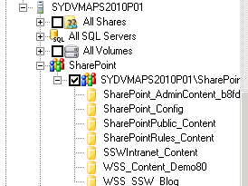
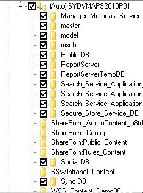

DPM is great for backing up SharePoint data, but when you select to back up the SharePoint role of a server, DPM will only backup the SharePoint\_Config database and the content databases, which is less than ideal.     To back up the SharePoint Server properly in DPM: 

1. Create a new Protection Group, for our example we will call it **SharePoint Protection **
2. In the new Protection Group, add protection for the for the SharePoint role on your SharePoint server:

Notice that SharePoint protection only selects the SharePoint\_Config and Content databases.
3. Now browse to the SQL Server and add the entire SharePoint SQL Instance to the **SharePoint Protection** group. You will notice that you are unable to select some of the databases, as they are already being protected by SharePoint role protection.

Ensure you back up the remaining databases in the SharePoint SQL Instance

 After following these steps you will have full protection of your SharePoint databases.
