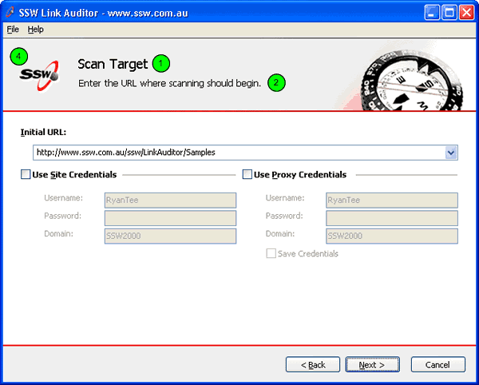
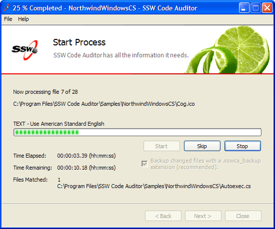

Though all software should be intuitive there are still times when users need extra                     guidance. Wizards are ideal especially for stepping through more complicated steps                     or when an application isn't going to be used regularly. E.g. SSW Code Auditor may                     only run once a month, during which time the user may forget all the steps involved.                     You can see an example of all the relevant steps at [Code Auditor User Guide](http://www.ssw.com.au/ssw/CodeAuditor/UserGuide.aspx).

Most importantly when a first time a user tries your program, they should be able                     to step through the setting up process. A wizard helps to show how your application                     flows from beginning to end.
 
​To ensure a consistent user experience, make sure to include these visual elements:

1. **Page name.** It is important for the user to know which page they<br>                        are currently on.
2. **Page description.** You should provide a short description of the<br>                        task to be performed on the page.
3. **Instructions.** Not required for every page, this is a short description<br>                        requesting the user to perform a task, for example, entering some values into a<br>                        text field.
4. **Company logo.** This helps promote branding, however it should be<br>                        inconspicuous and should not move visual focus away from the body of your application.<br>


[[goodExample]]
| 

Technical Note: To ensure visual consistency across applications, create a base                     form then set the properties in that form (application icon, menu structure, button                     names etc.) Add any logic in for switching pages with the "Next" and "Back"                     buttons. Then for all projects, add a reference to that one and inherit the customized                     form.

In the forms in your application, instead of inheriting from **System.Windows.Forms.Form**                     (the Default), inherit from your new base form class.


```
public class MyForm : System.Windows.Form.Form
```

                        Figure: Default code in a Windows Form

```
public class MyForm : Company.Framework.BaseCustomForm
```

                        Figure: Change the form so that it inherits from your new base form class
The "finish" button denotes the end of the Wizard; by clicking on it,                     the user closes the Wizard.

For longer processes, the Wizard should implement "Start" and "Skip"                     features to guide the user through from start to finish.

[[goodExample]]
| 

Here's some more information on the [Microsoft Standard for Wizard Welcome and Completion Page art](http://www.ssw.com.au/ssw/Redirect/Microsoft/wizard.htm) and [Interior Page art](http://www.ssw.com.au/ssw/Redirect/Microsoft/wizard2.htm).
