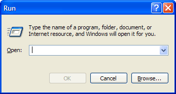
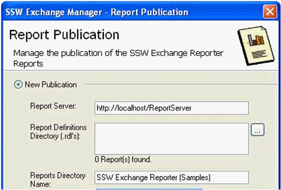
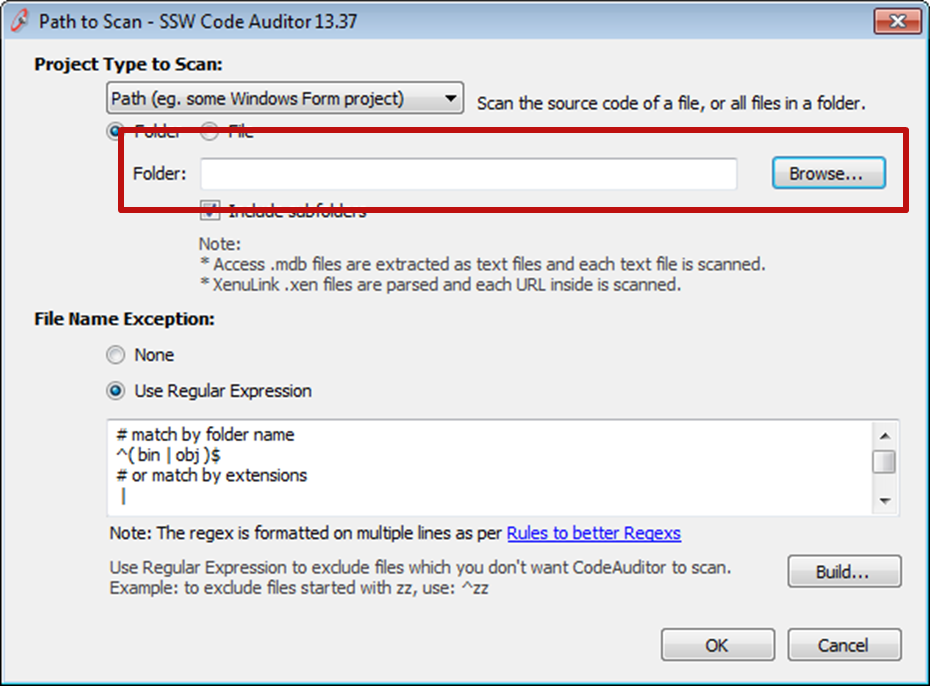

In menus (including context menus) or buttons, there are generally two types of actions:

1. ones that carry out an action without any further user intervention upon clicking;
2. and those that require further user input before the action is carried out

   
Microsoft applications use this technique to indicate whether or not the action will be carried out without any further user intervention. Your application should also follow this well-established standard, so users will not be caught off guard when an action carried out immediately after they click the menu item.

[[goodExample]]
| 
[[goodExample]]
| 
[[goodExample]]
| 
[[goodExample]]
| 
