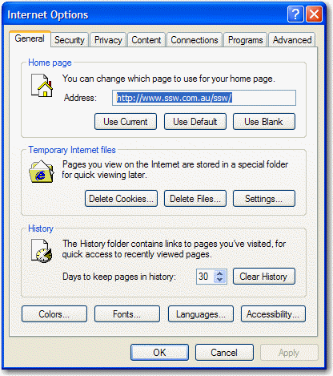
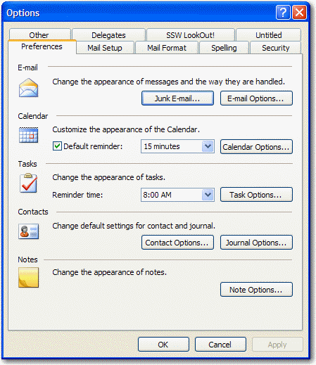
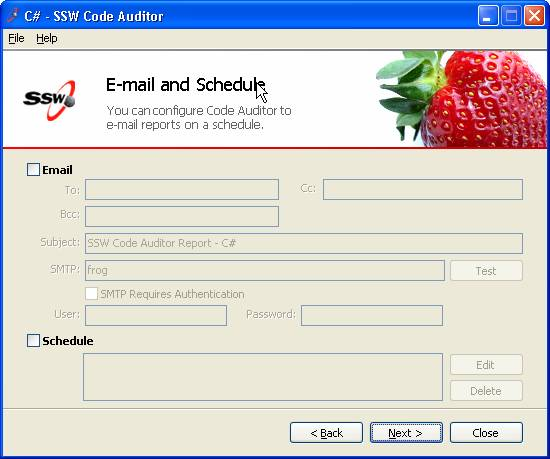

Many applications have a lot of content on each form. If this is the case there                     needs to be some way to separate certain sections. To achieve this separation Microsoft                     (and therefore most developers) uses separating lines, but this UI is not perfect                     because:

- It creates additional visual clutter
- It is hard to maintain

 
We recommend using bold instead of dividing lines because:

1. Bold stands out
2. Indentation is more important
3. Developers are not good at keeping the lines aligned - you could create a .NET custom control to do this - but Microsoft do not provide one
    - The dividing lines create additional visual clutter (ever so slight)
    - Each line creates additional performance implications (ever so slight)

[[badExample]]
| 
[[badExample]]
| 
[[badExample]]
| 
[[goodExample]]
| 
