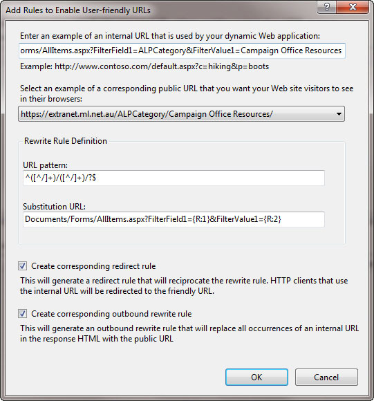

For maximum readability and SEO use kebab-case (dashes) in your URLs.
 
[greyBox]
 http://northwind.com/pageonworddocumentation 
[/greyBox]
 Figure: Bad example - No kebab-case in URL 

[greyBox]
 http://northwind.com/PageOnWordDocumentation 
[/greyBox]
 Figure: Bad example - PascalCase (better readability and still works in small caps, but other people might share it without the MixedCase) 

[greyBox]
 http://northwind.com/page on word documentation

...will become

 http://northwind.com/page20%on20%word20%documentation 
[/greyBox]
 Figure: Bad example - spaces it will show up in your URL structure as 20%, which is bad for readability and SEO

[greyBox]
 http://northwind.com/page\_on\_word\_documentation 
[/greyBox]
 Figure: OK example - underscored (snake\_case) URLs have good readability but are not recommended by Google

[greyBox]
 http://northwind.com/page-on-word-documentation 
[/greyBox]
Figure: Good example - kebab-case is recommended by Google

**Note:** this is only for the pages and documents within a website - not for the domain. Domains are bad when they have "-" in them!

Read more on [SEO 101: Hyphens vs. Underscores in URLs](https://www.seomechanic.com/seo-101-hyphens-underscores-_-urls/)

### More info

You can install the IIS [URL Rewrite Module](http://learn.iis.net/page.aspx/460/using-the-url-rewrite-module/) 
 for IIS7 you can make ugly URL's much more friendly.

The caveat here is that it will only work if the URL is in the clear on the page.

**Note:** This could only be done with certain links as others are postbacks as well.
