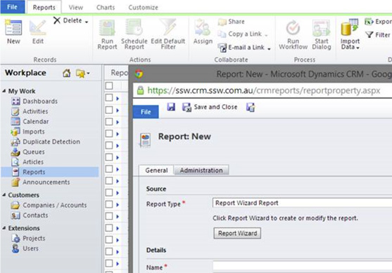
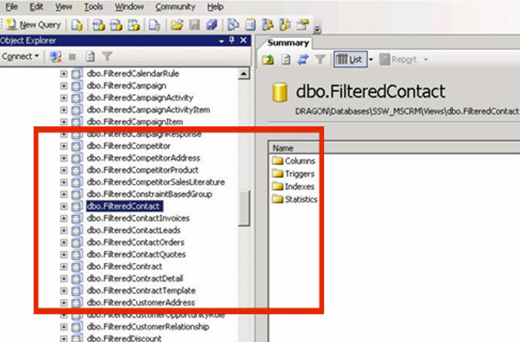

The built-in CRM report wizard is great for users to quickly and easily create reports in CRM.

But when the user wants to create a report that needs additional totals, different formatting, summaries in the header etc. A custom report is required.

Do you use Filtered Views or Fetch?

[Filtered Views](http://msdn.microsoft.com/en-us/library/gg309722.aspx) allows the report developer to query underlying SQL data directly. Filtered views are fully compliant with the Microsoft Dynamics CRM security model. When you run a report that obtains data from filtered views, the Microsoft Dynamics CRM security role determines what data you can view in the report.

[Fetch](http://technet.microsoft.com/en-us/library/bb928434.aspx) is a proprietary query language that is used in Microsoft Dynamics CRM. It is based on a schema that describes the capabilities of the language. The FetchXML language supports similar query capabilities as query expression. It is used primarily as a serialized form of query expression, used to save a query as a user owned saved view in the userquery entity or as an organization owned view in the savedquery entity.

Now with that out of the way which one do I use?

1. If you’re using CRM Online then you have no choice, you will use Fetch as CRM Online does not allow access to the underlying CRM SQL Database.
2. **If you are using On-Premise CRM and are \*unlikely\* to ever migrate to CRM Online then Filtered Views is the right choice.**
3. If you are using On-Premise CRM and there is \***any\*** chance of moving the CRM Online then use Fetch (otherwise your custom reports will need to be re-written to use Fetch).

Fetch Restrictions:

- Fetch does not support RIGHT OUTER JOIN and FULL OUTER JOIN.
- Fetch does not support EXISTS/IN condition with sub-query/expression.
- **An amount of 5000 returned records maximum.**
- No “UNION” selects.
- You cannot specify group by / sum queries – You can only select the records in detail and then perform the aggregation in your report.
- Number of entity join (link) limitations.
- **FetchXML reports cannot use non-CRM online data sources.**
- Learning curve – for report writers that are not familiar with FetchXML the syntax is quite different from SQL.

What do you need get started writing Fetch based CRM Custom Reports?

- Visual Studio (or BIDS, SSDT etc)
- [Dynamics Report Authoring Extensions](http://www.microsoft.com/en-au/download/details.aspx?id=27823)

Get up and running quickly with Fetch:

1. Create your report using the CRM Reporting Wizard
2. Save the RDL file
3. Import RDL file into Reporting Services Project
4. Update and enhance report
5. Upload back into CRM

More advanced users will have a boilerplate(s) for the various CRM report styles they produce and just build on top of the template.

Here’s an example of a before (CRM Wizard) and after (Visual Studio) for an Activity Report:

Five enhancements that required a custom report:

- Company logo top left
- Total call minutes in header
- Total call count and minutes totals for staff
- Links to regarding account (in a grouping)
- Colour coded series for charts that relate back to the report data headings

More Information:

- [Custom Reporting in Microsoft Dynamics CRM - Fetch vs. Filtered Views](http://blogs.msdn.com/b/crminthefield/archive/2012/11/27/custom-reporting-in-microsoft-dynamics-crm-fetch-vs-filtered-views.aspx)
- [Developing Fetch XML Based SSRS Reports](http://social.technet.microsoft.com/wiki/contents/articles/10234.microsoft-dynamics-crm-2011-develop-fetch-xml-based-ssrs-reports-in-visual-studio-2008.aspx)
