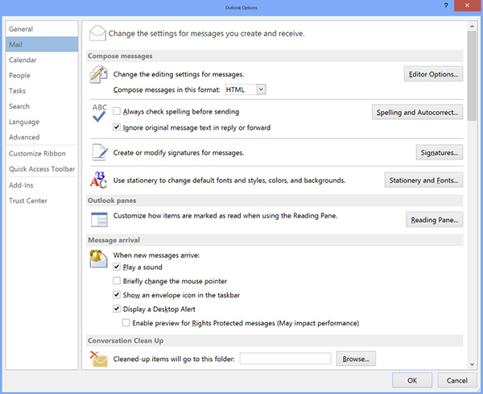
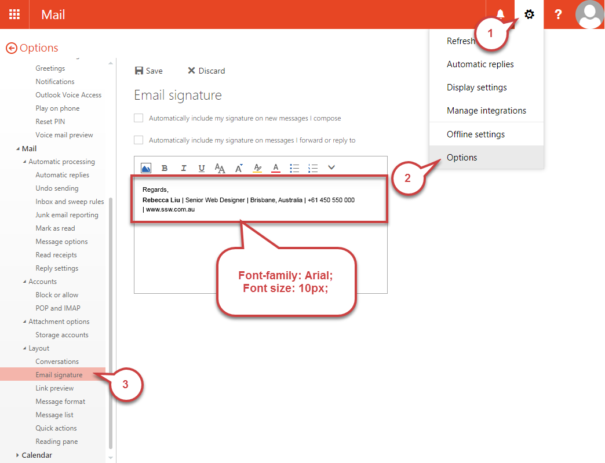
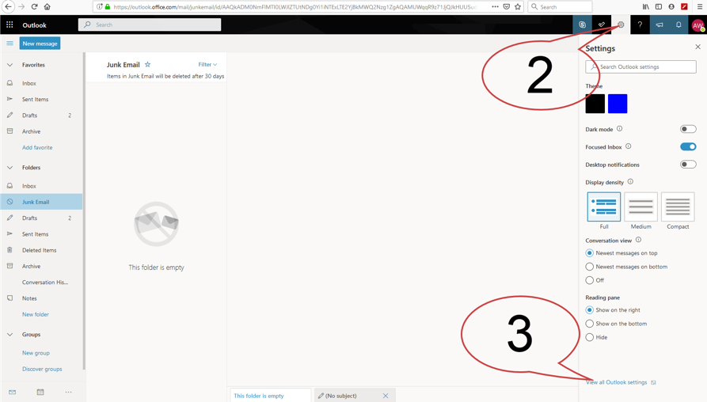

Email signatures are a great way of adding some advertising and branding. You should always use a nice email signature for **external emails**.
Internally, you shouldn't use any or just use a short one (just your name or initials).

Full email signatures are great when they have:

- A little **branding** and advertising (can be a tagline or company news), so people know instantly who it is from
- Your **phone number** (in international format - it's important to add the country code so people from all around the world can easily add you to their contacts - as per [Do you know the right format to show phone numbers?](/_layouts/15/FIXUPREDIRECT.ASPX?WebId=3dfc0e07-e23a-4cbb-aac2-e778b71166a2&TermSetId=07da3ddf-0924-4cd2-a6d4-a4809ae20160&TermId=19e719e8-a1ff-47c4-a642-5c7e3189f25e))
- Your company **website link **(e.g. www.ssw.com.au/)
- Your work-related **social media** and **blog** link
- Your **position**
- Your **location** (city/country) where you are based

Mobile signature are not easily customized so they can be simpler.

 
### Mobile Signature 

Use the "mobile signature" when sending emails from your phone.

Get Outlook for Android
Figure: Bad example - This default signature sucks

Thanks, Adam
www.ssw.com.au  | +61 4 1985 1995
Figure: Good example – Add your name, URL and your phone number

### PC Long Signature

**Use the complete "long signature" when sending a new email or appointment to a client.**

This is created in HTML and goes well on emails with Word used as the email editor. Include some product advertising, like what's new on your monthly newsletter. It should have the company colors.

However, you shouldn't use your long signature on     **every** sent email. It's recommended to have a simpler version for internal emails and appointments:
### PC Short Signature

Use a really short signature (your first name or initials) or no signature at all in internal emails as people already know who you are.

**Note #1:** You can see Ulysses using this rule in practice, along with other best practices, on this short [demonstration video.](http://www.youtube.com/watch?v=LAqRokqq4jI)

### More Information

**How to set it up in Outlook**

1. Open Microsoft Outlook and go File | Options
2. Click the "Mail" tab as seen below
3. Click on "Signatures..." and add in your signatures

**How to set it up in OWA**

1. Open OWA (e.g. http://mail.northwind.com/owa)
2. Click "Options" on the top right side.  
3. Go Settings | Mail and make following changes:  

**How to set it up in Office 365**

1. Open Outlook in Office 365 ([http://outlook.office.com/mail/inbox](https://outlook.office.com/mail/inbox))
2. Click the "Settings" cog on the top right corner of the Window
3. Click on “View all Outlook settings” at the bottom of the Settings panel        
4. In the "Settings" window that pops up, go to: Mail | Compose and reply.
5. Add your email signature and click "Save"

**Warning:** Unfortunately you need to setup up your signature in Outlook and OWA. There is no way to share this.

**SSW Only:** You can automatically have your Outlook signature changed on sign-in via a script. See https://github.com/SSWConsulting/LoginScript.
