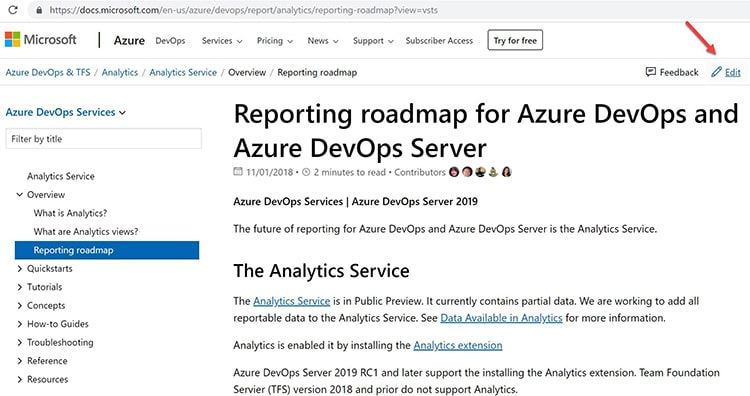
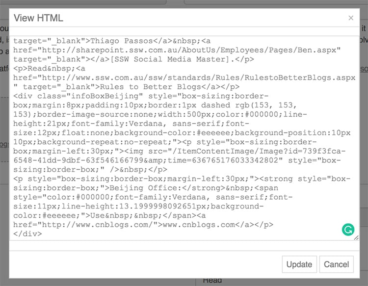
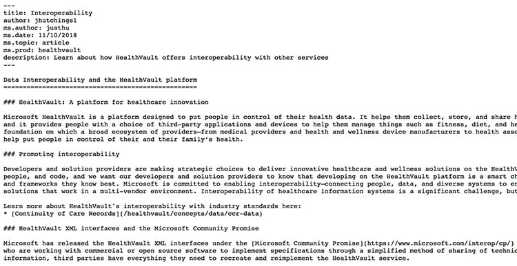
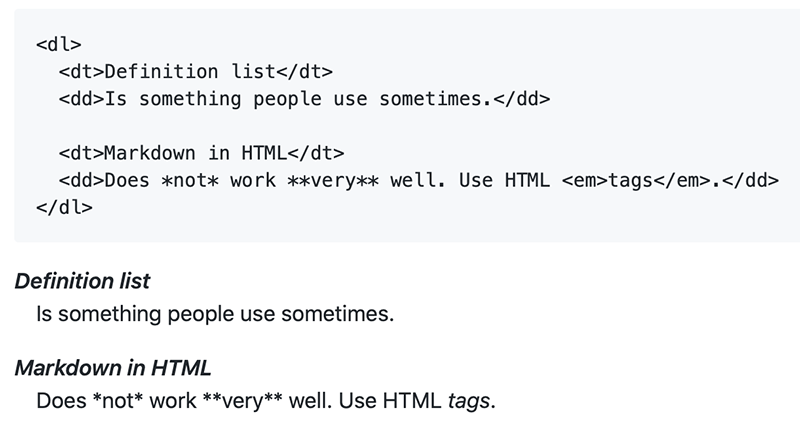
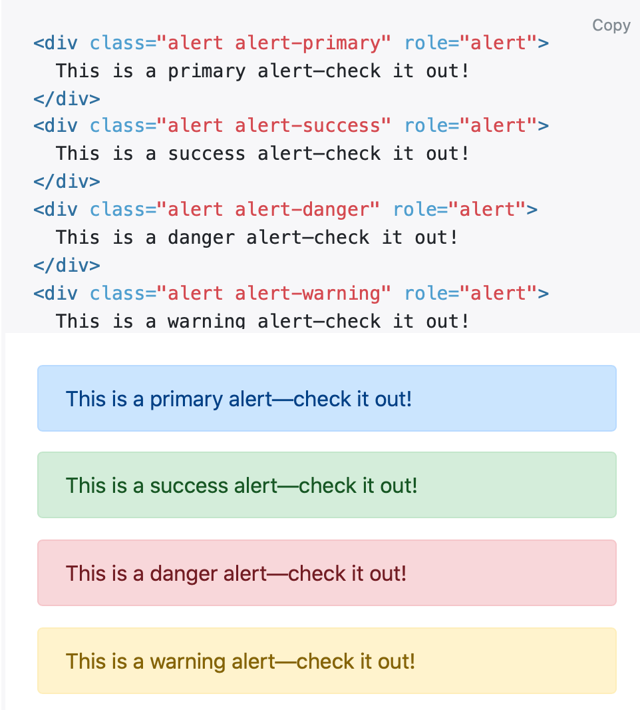
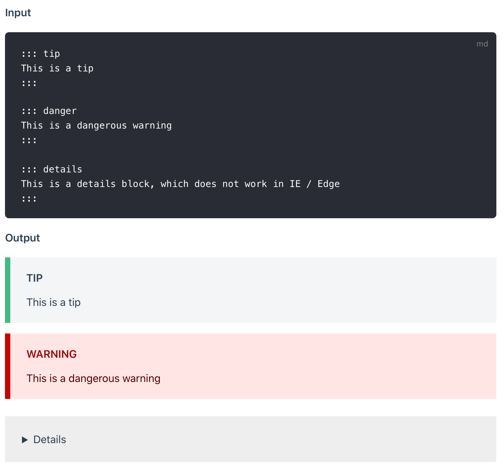
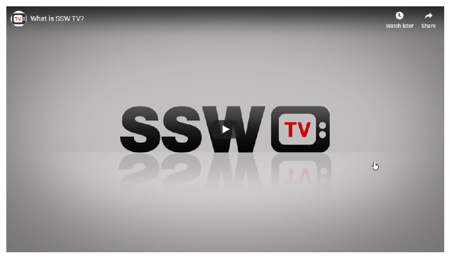
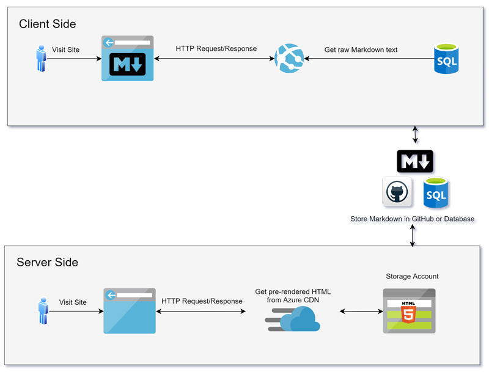

You want users to easily edit content, so you put an "edit" button on the page. From there, you can choose between the power of HTML or the limitations of Markdown.

**HTML** is frightening for most users, as one wrong tag or an inline styling can break the whole page view.

**Markdown** is simpler and encourages more editing without breaking the page.

The original spec for Markdown can be found at https://daringfireball.net/projects/markdown/syntax. Although, it does not specify the syntax unambiguously – so there are different flavours of the spec available. Some popular ones include:

- [Commonmark Spec](https://spec.commonmark.org/0.29/)
- [GitHub Flavored Markdown (GFM) Spec](https://github.github.com/gfm/)
- [markdown-it](https://github.com/markdown-it/markdown-it) (really flexible, pluggable library based on CommonMark)

The [Markdown Cheatsheet](https://github.com/adam-p/markdown-here/wiki/Markdown-Cheatsheet) is a great page to reference when learning Markdown.

If you use markdown-it, there are many plugins that allow you to extend markdown. [SugarLearning](https://sugarlearning.com/) provides a more extensive [cheatsheet](https://my.sugarlearning.com/SSW/items/13308/markdown-cheatsheet) which includes a number of custom templates and markdown-it plugins.

### Videos

Watch the video "Markdown -  How to use it, What is it and Why Use it | Ask a Dev":

 

Watch the video where Thiago explains the benefits of using Markdown:  
 
 
### Don't store content as HTML - It's a trap 

Rich HTML Editors make your life easier at the beginning and produce content that looks nice and clean, but behind the scenes, it generates HTML which can get out of control quickly especially if you need to edit the source code (E.g. include a special style). It becomes incredibly difficult to maintain over time.

Some examples of rich HTML editors that you can embed in your web applications:

- [Kendo Editor](https://www.telerik.com/kendo-angular-ui/components/editor/)
- [TinyMCE](https://www.tiny.cloud/)
- [CKEditor](https://ckeditor.com/)

**Note:** None of these are recommended because of the HTML that is generated.

[[badExample]]
| 

### Store content in Markdown

Content is typically either stored in files (eg. git) or a database. When stored in files, it is common to use a static site generator with a JAMStack approach. (eg. Gatsby, Vuepress, Hexo, etc) That is, you commit content into git and a CI/CD pipeline is executed. The resulting files (html and css) are then served from storage which is cheaper and typically more scalable than compute resources in the cloud. In this case, the workflow will be a development style workflow (commit to git, push, etc) and the editor will be the one you choose. (e.g. GitHub editor or VS Code) These editors are not likely to produce a rich editing experience, nor do they need to.

For a non-technical audience, it helps to store your content as markdown in a database and convert to HTML on the fly. This removes the code repository/CI/CD pipelines and can feel more natural for a non-developer audience. In this case, you will provide an editor and it is recommended that this be a rich editor.

Markdown rich editors

The Markdown rich editors are not as good as the HTML ones, but at least the content they produce is maintainable over time.

Some example of rich Markdown editors are:

- [ProseMirror](http://prosemirror.net/)
- [Editor.Md](https://pandao.github.io/editor.md/)
 Note: It is the #1 editor on        [Top 7: Best Markdown editors Javascript and jQuery plugins](https://ourcodeworld.com/articles/read/359/top-7-best-markdown-editors-javascript-and-jquery-plugins)
- [ToastUI Editor](https://ui.toast.com/tui-editor/) (recommended)
Note: ToastUI provides more customisation options (menu and language) than Editor.md

[[goodExample]]
| 

### Markdown can have rich content too

Markdown is simple and limited, but you can make it richer.

One way is to use inline HTML, this allows you to use HTML tags that you are familiar with (only if you need to) and embed things like YouTube videos or JavaScript.

[[okExample]]
| 

The other way is to use templates or containers:

[[badExample]]
| 

A better way is to use a plugin (if your Markdown engine supports it).

[[goodExample]]
| 

Unfortunately, Markdown does not support YouTube videos embedding out of the box. However, there is a workaround to embed it.

[[goodExample]]
| 

If your site is using "[markdown-it](https://www.npmjs.com/package/markdown-it)" parser, you can also install "[markdown-it-video](https://www.npmjs.com/package/markdown-it-video)" to allow YouTube video directly embedded into the page, rather than providing just an image and a link.

@[youtube](http://www.youtube.com/embed/dQw4w9WgXcQ)

### Markdown to HTML rendering processes

