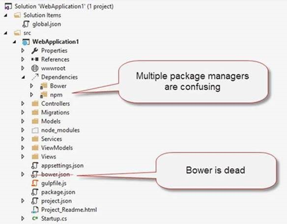

Advice like this can be a minefield, and is constantly in flux, but there are some rules-of-thumb that can make life simpler.

<!--endintro-->

### Bower is dead

File-New Project in Visual Studio comes with bower packages, and there are a lot of old blog posts that  recommend bower for client side libraries, but bower is dead. Angular2 is discouraging its use, and npm has all the same packages, and more. Prefer npm over bower, even for client-side dependencies.

### Use a single package manager

For client side libraries, avoid mixing npm, jspm and manually copy/pasted files. Life will be simpler if you stick with just 1.

Right now, this is npm, but watch out for jspm, which shows a lot of promise if you can get past the steep learning curve.

### Be careful with versioning

Theoretically, everything in npm is using semantic versioning.  In practice, people aren’t that diligent, so it pays to be careful with your version numbers. It’s not rare for versions to disappear from npm, or for a build-servers internet connection to be flaky.  If these issues are happening, consider using        [npm-shrinkwrap](https://docs.npmjs.com/cli/shrinkwrap) to lockdown dependency versions.

### Track your dev dependencies and dependencies separately

All package managers distinguish between those used for development, and those used for the application.  Use this feature – it will save you time.
