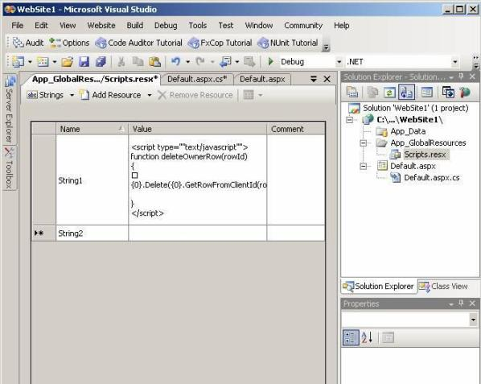
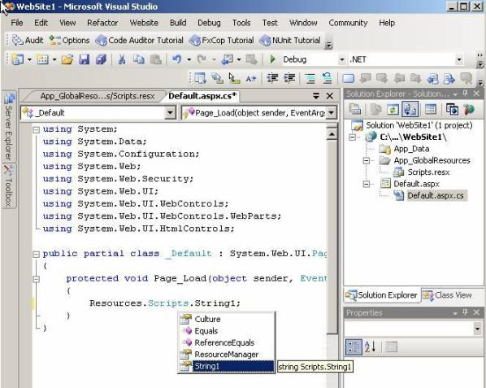

Write a Intro pragraph here  
<!--endintro-->

##  


```
StringBuilder sb = new StringBuilder();<br>     sb.AppendLine(@"<script type="" text/javascript""="">");<br>     sb.AppendLine(@"function deleteOwnerRow(rowId)");<br>     sb.AppendLine(@"{");<br>     sb.AppendLine(string.Format(@"{0}.Delete({0}.<br>        GetRowFromClientId(rowId));", OwnersGrid.ClientID));<br>     sb.AppendLine(@"}");<br>     sb.AppendLine(@"</script>");
```

Bad example - Hard to read ?the string is surrounded by rubbish + inefficient because you have an object and 6 strings 


```
string.Format(@"<script type="" text/javascript""="">                  <br>       function deleteOwnerRow(rowId)                    <br>      { {0}.Delete({0}.GetRowFromClientId(rowId)); } </script> ", <br>       OwnersGrid.ClientID);
```

Good example Slightly easier to read ?but it is 1 code statement across 10 lines 

```
string scriptTemplate = Resources.Scripts.DeleteJavascript;<br>     string script = string.Format(scriptTemplate, OwnersGrid.ClientID);
```


```
<script type="" text/javascript""=""><br>     function deleteOwnerRow(rowId)<br>     {<br>            {0}.Delete({0}.GetRowFromClientId(rowId));<br>     }<br>     </script>
```


**Figure: The code in the first box, the string in the resource file in the 2nd box. This is the easiest to read + you can localize it eg. If you need to localize an Alert in the javascript**



