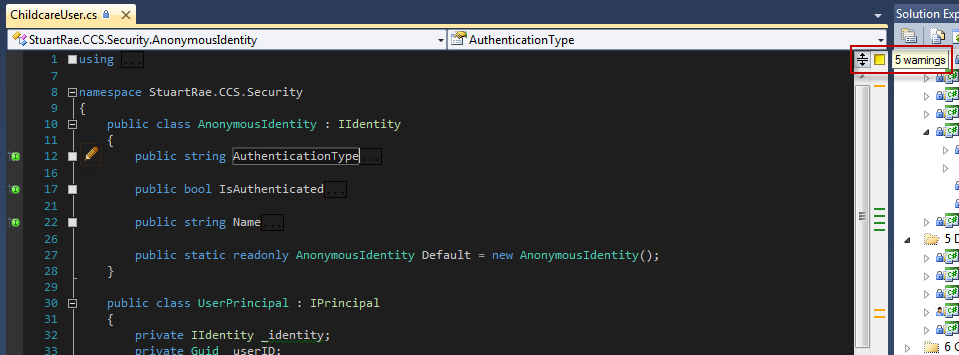
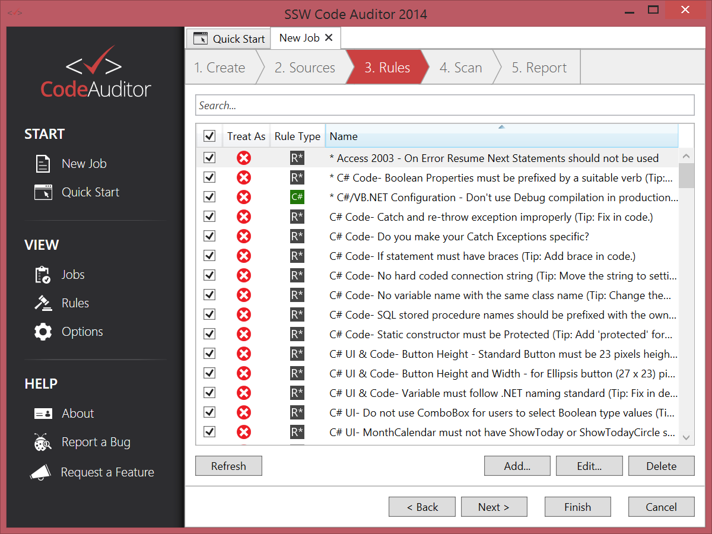
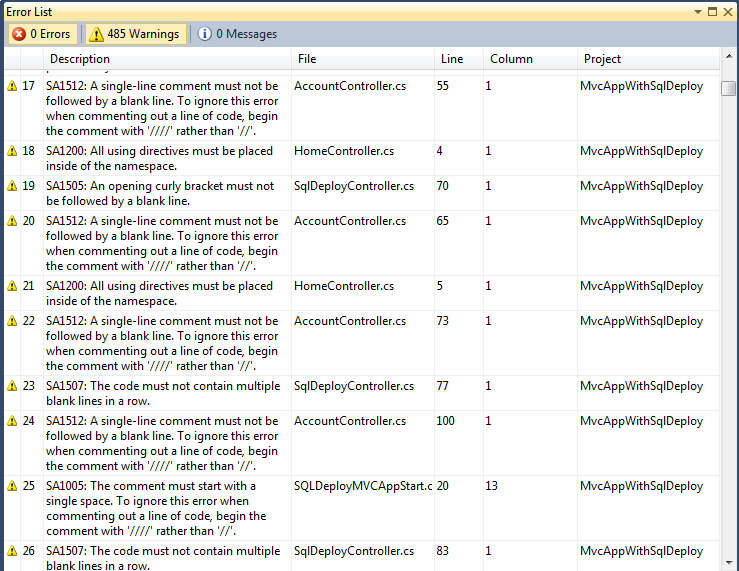
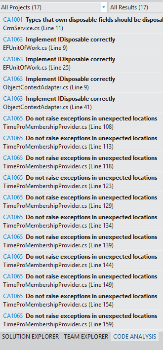
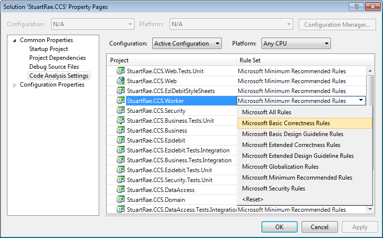
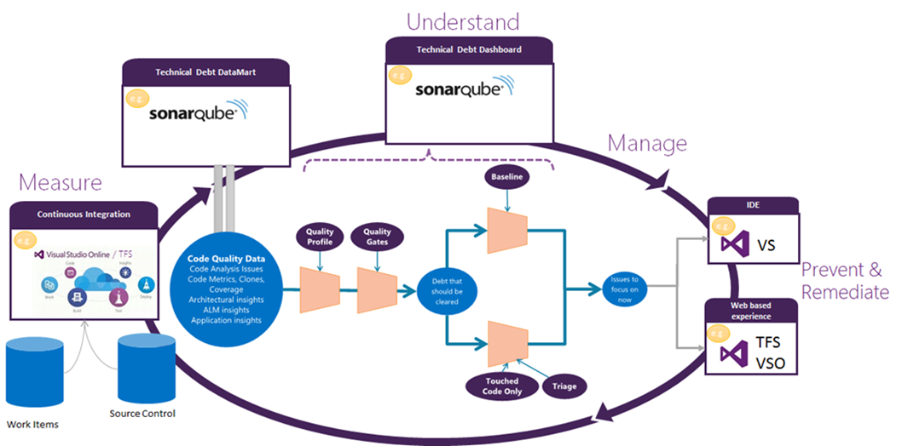
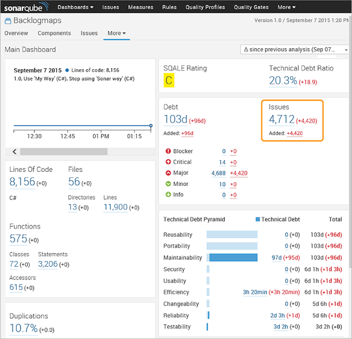

Whenever you are writing code, you should always make sure it conforms to your team's standards. If everyone is following the same set of rules; someone else’s code will look more familiar and more like your code - ultimately easier to work with.

No matter how good a coder you are, you will always miss things from time to time, so it's a really good idea to have a tool that automatically scans your code and reports on what you need to change in order to improve it.

Visual Studio has a great Code Analysis tool to help you look for problems in your code. Combine this with Jetbrains' ReSharper and your code will be smell free.

The levels of protection are:
 

### Level 1

Get ReSharper to green on each file you touch. You want the files you work on to be left better than when you started. See     [Do you follow the boyscout rule?](http://www.ssw.com.au/ssw/standards/rules/RulestoBetterCode.aspx#BoyscoutRule)

**Tip:** You can run through a file and tidy it very quickly if you know two great keyboard shortcuts:

- Alt + [Page Down/Page Up] : Next/Previous Resharper Error / Warning
- Alt + Enter: Smart refactoring suggestions

 

 

### Level 2

Is to use     [Code Auditor.](http://www.ssw.com.au/ssw/CodeAuditor/Default.aspx)

**Note:** Document any rules you've turned off.

### Level 3

Is to use     [Link Auditor](http://www.ssw.com.au/ssw/LinkAuditor/).

**Note:** Document any rules you've turned off.

### Level 4

Is to use StyleCop to check that your code has consistent style and formatting.

### Level 5

Run Code Analysis (was FxCop) with the default settings or ReSharper with Code Analysis turned on

### Level 6

Ratchet up your Code Analysis Rules until you get to 'Microsoft All Rules'

### Level 7

Is to document any rules you've turned off.

All of these rules allow you to disable rules that you're not concerned about.  There's nothing wrong with disabling rules you don't want checked, but you should make it clear to developers why those rules were removed.

Create a     **GlobalSuppressions.cs** file in your project with the rules that have been turned off and why.

**More Information:** [Do you make instructions at the beginning of a project and improve them gradually?](/_layouts/15/FIXUPREDIRECT.ASPX?WebId=3dfc0e07-e23a-4cbb-aac2-e778b71166a2&TermSetId=07da3ddf-0924-4cd2-a6d4-a4809ae20160&TermId=d6d34c31-ac6a-49a4-876a-f9d30e1ab78a) and     https://docs.microsoft.com/en-us/visualstudio/code-quality/in-source-suppression-overview

### Level 8

The gold standard is to use     [SonarQube](https://www.sonarqube.org/), which gives you the code analysis that the previous levels give you as wells as the ability to analyze technical debt and to see which code changes had the most impact to technical debt

 

