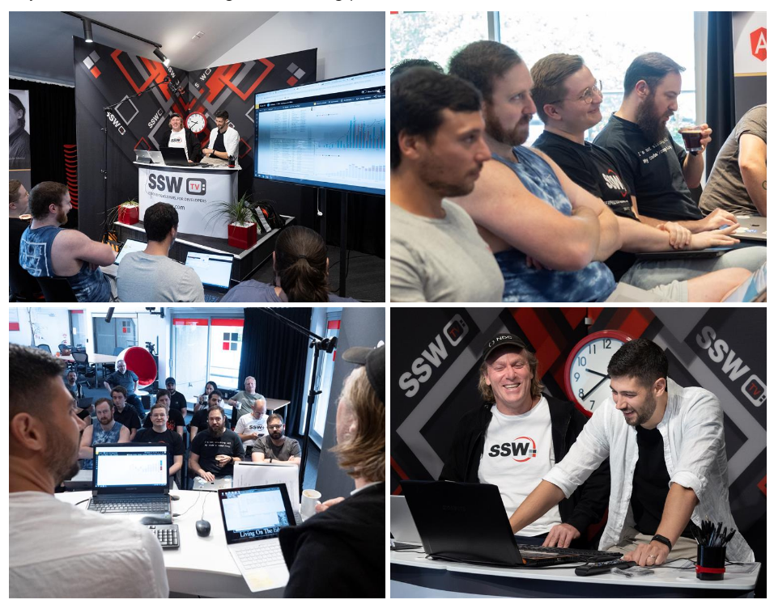
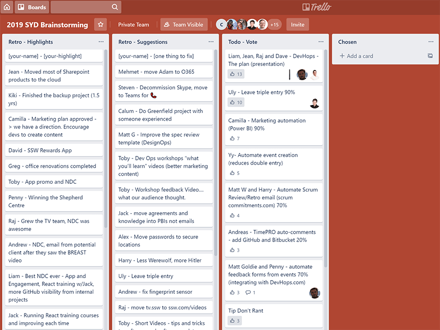
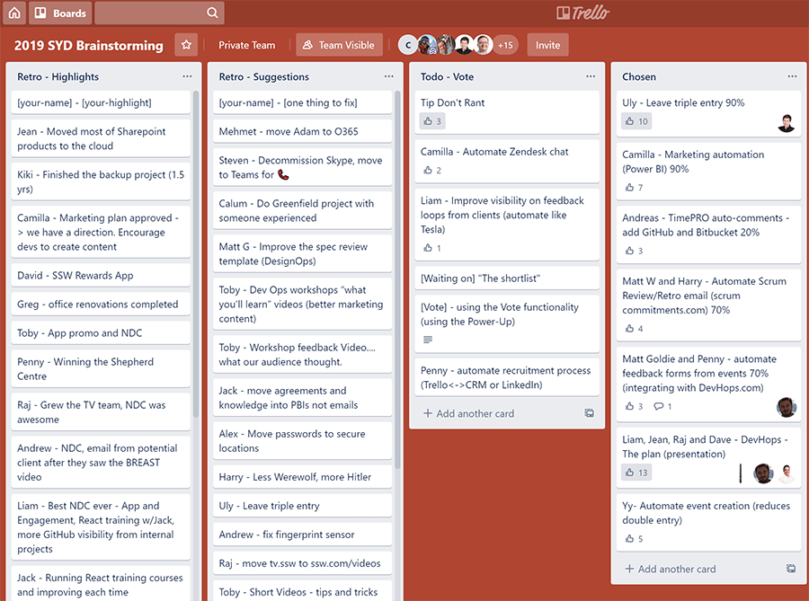

 
​Employees are a company's best resource, but often there is no light shone on their knowledge. A great way of making this happen is to conduct a brainstorming day. Check out this video!
 

 ​  
​​Employees on the front line often have valuable insights into opportunities for improvement, what is painful, increased efficiency and even entirely new business ideas.​​ Empowering these employees with an annual brainstorming day is a great way to transform their good ideas into valuable solutions, as well as giving them the opportunity to learn and grow from each other. Also, many employees enjoy the opportunity to flex their creative muscles in fun ways that their day-to-day jobs may not always afford them.

Different companies have different approaches to this. For example:

- Atlassian - give employees 1 day a year to work on a feature they want
- Google - employees are allowed to dedicate 20% of their time to 'pet projects' (subject to approval)
- Microsoft - Scott Guthrie takes senior leadors offsite for 1 week each year
- SSW - Adam Cogan conducts an annual brainstorming day in each state office

### How an annual brainstorming day works

At an annual brainstorming day, employees are invited to share their ideas, give feedback, and pick the best one to work on. The benefits of brainstorming are     [well understood](https://raybourn.com/the-5-benefits-of-brainstorming/), but in order to focus the productivity on something useful, it is important to have a system for suggesting, voting, and working on ideas.

Everyone at the company is encouraged to suggest ideas prior.

The process is broken down into 2 key stages: preparation and participation.

### ​ Preparation​​​​​ 

**1. Email Attendees**

Start by sending out an email to staff, inviting them to send through their suggestions in advance.
e.g.:

​     Hi All,

I’m really excited about our brainstorming day! I hope you’re all thinking about what you would like to work on.

 To prepare for our Brainstorming day, send Adam and Matt W. something that you would like work on as a group.
 Eg. Our awesome SophieBot project came out of the Melbourne Brainstorming Session last year. ​  

See video on:     [https://rules.ssw.com.au/do-you-use-the-brains-of-your-company](/_layouts/15/FIXUPREDIRECT.ASPX?WebId=3dfc0e07-e23a-4cbb-aac2-e778b71166a2&TermSetId=07da3ddf-0924-4cd2-a6d4-a4809ae20160&TermId=0ce40380-0daa-4f75-b289-de8f7de6683e)
​ 

**Agenda**

**Friday 29th of November **

**9:00am** – Meet upstairs in Suite 15        
**9:30am** – Discuss items to work on & vote        
**10am** – Start work on your fave tech project (in groups)        
**10.30am** – Coffee order        
**1pm** – Lunch        
**2pm** – Continue work        
**​4pm** - Presentations        
**6pm** – The pub
[​Good Example: Email template for brainstorming attendees
**2. Setup Trello**](/_layouts/15/FIXUPREDIRECT.ASPX?WebId=3dfc0e07-e23a-4cbb-aac2-e778b71166a2&TermSetId=07da3ddf-0924-4cd2-a6d4-a4809ae20160&TermId=0ce40380-0daa-4f75-b289-de8f7de6683e)
[Use Trello to manage and vote on the suggestions, using the](/_layouts/15/FIXUPREDIRECT.ASPX?WebId=3dfc0e07-e23a-4cbb-aac2-e778b71166a2&TermSetId=07da3ddf-0924-4cd2-a6d4-a4809ae20160&TermId=0ce40380-0daa-4f75-b289-de8f7de6683e)[voting Power-Up](https://trello.com/power-ups/55a5d917446f517774210013/voting). First add the voting Power-Up, then​ set up your board for the day:

- ​Create a list called 'Retro - Highlights'
Add a template card ('[your name] - [your highlight]')
- ​Create a list called 'Retro - Suggestions'
Add a template card ('[your name] - [one thing to fix]')
- ​Create a list called 'Todo - Vote'
- Create a list called 'Chosen'

During the session, you will populate these lists with the input from the attendees.

**3. Pre-cooked suggestions**

​By the time you get to the session, everyone should have emailed you through their suggestions. But it can still be intimidating for some people to be the first person to get up and share their idea with the group. To get the ball rolling, you should have some suggestions prepared in advance, preferrably provided by some of your team. Have them record a short video that 'sells' their idea, ready to show the attendees at the start of the session.​​​ -cover emailed suggestions, ask for new ones, talk about pre-cooked ones

### Participation

On the day, follow the agenda set out in your attendee email:

- Have the Trello board showing on a projector.
- Send all attendees invitations to the Trello board.
- 9am: Welcome everyone and thank those that submitted ideas.
- Call out who the scribe is. (They will update the Trello board in the background).
- Retro: hearing everybody's top highlight. (The scribe will add these to the list).
- Suggestions: Hear everyone's top pain (the scribe adds these too).
- Suggestions: Once you have everyone's highights, share the pre-cooked suggestions you have prepared (hopefully a video or two).
- Vote: invite attendees to vote via Trello for the suggestion they would most like to see implemented at your company. Depending on the size of your team, you may choose to allow each attendee 3 votes.
Eg. "Guys, you've got 5 minutes to get your 3 votes in"
- Vote Results: after the votes are in, you can reveal the top voted suggestions. The attendees then break into smaller groups and set to work building a prototype or proof of concept. 
**TIP:** The moderator can decide which suggestions are viable and invite attendees to self-organise
- 1pm: Give the attendees a break for lunch.
- 4pm: Attendees come back in, and each group takes turns presenting their work to the rest of the attendees.

**NOTE**: The top voted suggestion may not be technical, and the prototype or proof of concept doesn't have to be a technical solution. It coud very well be a protoype applciation or website, but equally could be a new business process or a video.

​
Good​ Example: A brainstorming session is like an office party but more productive​​​​​Good Example: A Trello board with the voting power-up allows people to suggest and vote on ideas they would like to work on in the brainstorming session​​​​Good Example: The selected ideas are moved from the Vote column to the Chosen column and the real fun begins!​

