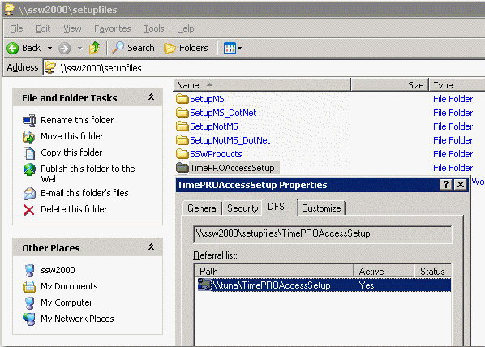

Occasionally, one server and its drives will not have sufficient space to store all related files in a network share. For example, you may have a "SetupFiles" directory that stores all Setup executables on your network e.g. \\bee\SetupFiles. There are problems with this approach.
 
1. You will run out of space - which means you will have to copy or move old (but still used) setup files around to other drives (\\bee\d$\SetupOld\ ) or other machines e.g. \\tuna\SetupFiles. This fragmentation of your setup files can cause confusion for your users.
2. When you retire or rename the old server, links to the old server location will not work

So how do you get around this problem? The answer is in the **Distributed File System (DFS)**. Instead of having several server-specific file share locations, you can have a domain-wide setup location that offers a seamless experience to your users. DFS will even track a history of when and where file locations were moved.

