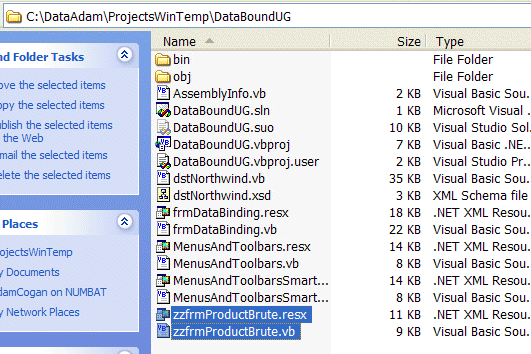

 ​​​When you are regularly creating new releases of a cool .NET application or simply producing new proposals in Microsoft Word, files will inevitably become outdated. Rather than hit the DELETE key put a 'zz' at the front of the filename. The old versions should not be deleted straight away - it is just an unnecessary risk! The zz'd files can remain there until you need more space, then you should delete them. Figure: 'ZZ' your files rather than deleting them! 
Alternatively ​add a folder named zz and move the outdated files into the new folder.

Note: Other systems are used that are less aggressive than our 'zz' rule.

- In .NET, the keyword        [obsolete​](https://msdn.microsoft.com/en-us/library/22kk2b44%28v=vs.90%29.aspx)  is used to mark types and members of types that should no longer be used - these then turn up as a compiler warning.
- In HTML, the keyword        [deprecated](http://www.ssw.com.au/ssw/Redirect/Deprecated.htm)  is used.

Both allow for some backward compatibility.

See our     [Rules to Better SQL Server Databases - Do you add zs prefix to table name?](http://www.ssw.com.au/ssw/Standards/Rules/RulesToBetterSQLServerDatabases.aspx#ZSPrefix)

**Note:** [You should not ZZ if you are using Source Control](/do-you-know-zz-ed-files-must-not-exist-in-source-control).

