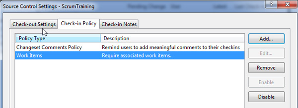
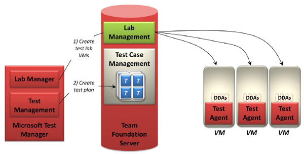
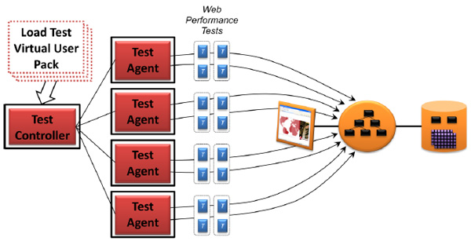

Having a clear Definition of Done for your team is critical to your success and quality management in Scrum.

Every team is different, but all need to agree on which items are in their "Definition of Done".  
# There are 3 levels of 'Done' in communication

## Level 1

- Sending a ["Done" email](/_layouts/15/FIXUPREDIRECT.ASPX?WebId=3dfc0e07-e23a-4cbb-aac2-e778b71166a2&TermSetId=07da3ddf-0924-4cd2-a6d4-a4809ae20160&TermId=29d5ca5d-c191-475f-8db2-0086c44ca46c)

## Level 2

- Sending a "Done" email
- Screenshots
- Code

## Level 3

- Sending a "Done" email
- Recording a quick and dirty "[Done Video](/_layouts/15/FIXUPREDIRECT.ASPX?WebId=3dfc0e07-e23a-4cbb-aac2-e778b71166a2&TermSetId=07da3ddf-0924-4cd2-a6d4-a4809ae20160&TermId=215be2dd-4a90-4f0f-a5fa-dbed2edca461)"
- Code (showing a full scenario e.g. a user story)

#### Example of a level 3 "done"

Subject: RE: Manad - Coded UI Tests #2

> Create a new CodedUI test on your feedback form – search only to test the Telerik

Done
 Figure – Coded UI Test passes in Visual Studio
Jing Video of the test running: http://screencast.com/t/ps17fqsV

Figure: Good example - The "done" shows a full scenario
# There are 8 levels of 'Done' in software quality

Start with these examples showing typical "Definitions of Done" from beginner teams to more mature teams:

## Team - Level 1

- The code compiles
- All tasks are updated and closed
- No high priority defects/bugs are on that user story

## Team - Level 2

- *All of the above, plus*
- All unit tests passed
- Greater than 1% code coverage (not earth shattering, but you need to start somewhere)

## Team - Level 3

- *All of the above, plus*
- Successful build on the Build Server
- [Git Branch Policies](/_layouts/15/FIXUPREDIRECT.ASPX?WebId=3dfc0e07-e23a-4cbb-aac2-e778b71166a2&TermSetId=07da3ddf-0924-4cd2-a6d4-a4809ae20160&TermId=a338566a-7f63-48ea-8cb0-5cb6ffda5d06) 
or
TFS Check in Policy - Change set Comments Policy (all check-ins must have a comment)
- TFS Check in Policy - Work Items (all check-ins must be associated with a work item)
- Code reviewed by one other team member (e.g. Checked by Bill)
- Sending a Done email with screenshots

 [[goodExample]]
|  
## Team - Level 4

- *All of the above, plus*
- All acceptance criteria have been met
- All acceptance criteria have an associated test passing (aka. Automated functional testing with Web Tests (Selenium), Coded UI Tests, or Telerik Tests)
- Tip: Use Microsoft | [Test Manager](https://marketplace.visualstudio.com/items?itemName=ms.vss-testmanager-web)
- Sending a Done email (with video recording using SnagIt)

  ](TestPlanning-1.png) 

 
Figure: Good example - Done video showing the features worked on
## Team - Level 5

- *All of the above, plus*
- Deployed to UAT (ideally using Continuous Deployment)
- Complex code is documented (removing technical debt)
- Product Owner acceptance

## Team - Level 6

- *All of the above, plus*
- Multiple environments automatically tested using Lab Management

 [[goodExample]]
|  
## Team - Level 7

- *All of the above, plus*
- Automated Load Testing
- Continuous Deployment

 [[goodExample]]
|  
## Team - Level 8 (Gold)

- *All of the above, plus*
- Deployed to Production

Congratulations! You are frequently deploying to production. This is called “Continuous Delivery” and allows you to gather quick feedback from your end users.
    You might have everything deployed to production, but it might not yet be visible to the end user. This can be achieved by having “[Feature toggles](http://martinfowler.com/bliki/FeatureToggle.html) ” in place. The actual release of the functionality is a decision that the Product Owner and business takes.
 

**More Information: **

- [Do your user stories include acceptance criteria?](/_layouts/15/FIXUPREDIRECT.ASPX?WebId=3dfc0e07-e23a-4cbb-aac2-e778b71166a2&TermSetId=07da3ddf-0924-4cd2-a6d4-a4809ae20160&TermId=a4a9c23a-4f68-4922-9605-83628509dc48)
- [Do you enforce comments with check-ins?](http://www.ssw.com.au/ssw/Standards/Rules/RulesToBetterSourceControlwithTFS.aspx#EnforceComments "Do you enforce comments with check-ins?")
- [Do you enforce work item association with check-in?](http://www.ssw.com.au/ssw/Standards/Rules/RulesToBetterSourceControlwithTFS.aspx#EnforceWorkItemAss "Do you enforce work item association with check-in?")
- [Do you follow a Test Driven Process?](http://www.ssw.com.au/ssw/Standards/Rules/RulesToBetterVersionControlwithTFS%28AKASourceControl%29.aspx#TestDrivenProcess "Do you follow a Test Driven Process?")
- [Do you have a "Definition of Ready"?](/_layouts/15/FIXUPREDIRECT.ASPX?WebId=3dfc0e07-e23a-4cbb-aac2-e778b71166a2&TermSetId=07da3ddf-0924-4cd2-a6d4-a4809ae20160&TermId=e01abde1-9a3e-4e4c-84a8-50e98e9c44d0)
