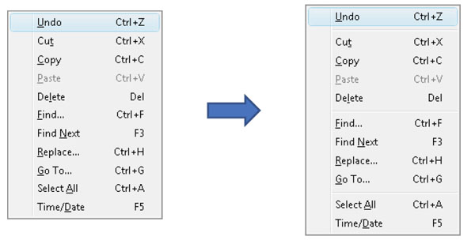
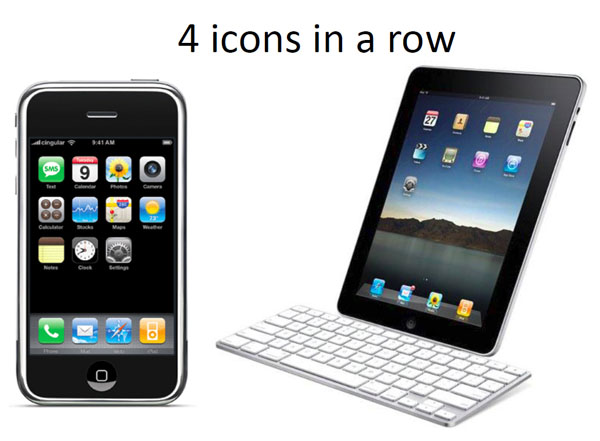

The human brain:

1. Never searches for OR compares all options
2. Prefers smaller sets of options (4 or less)
3. Picks the first option that looks good enough
4. Prefers a shorter option to a longer one
5. Makes a compromise between speed and accuracy

 
It's important to keep these in mind when making design decisions or presenting data.

Our visual short term memory has a capacity of 4 items. So options are easier for our brain to digest when presented in sets of 4.

[[goodExample]]
| 
