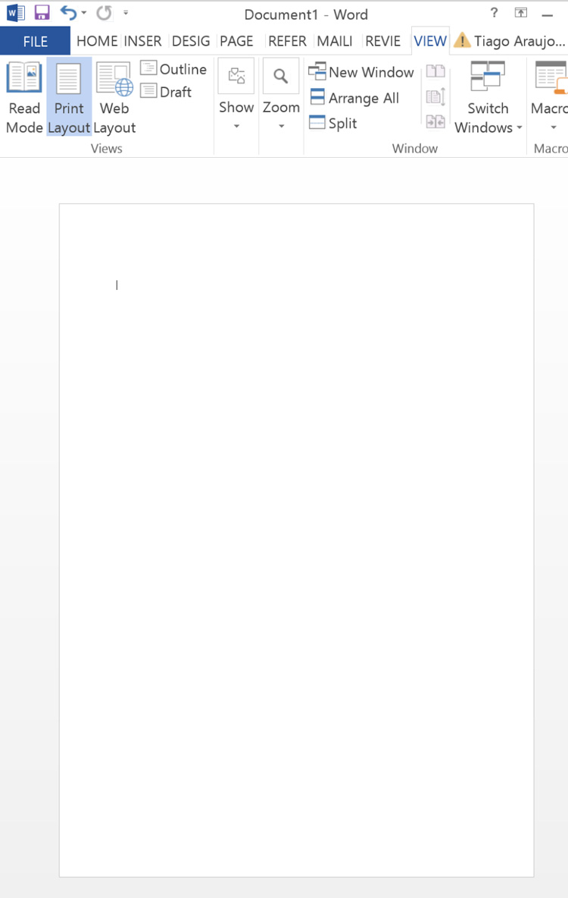
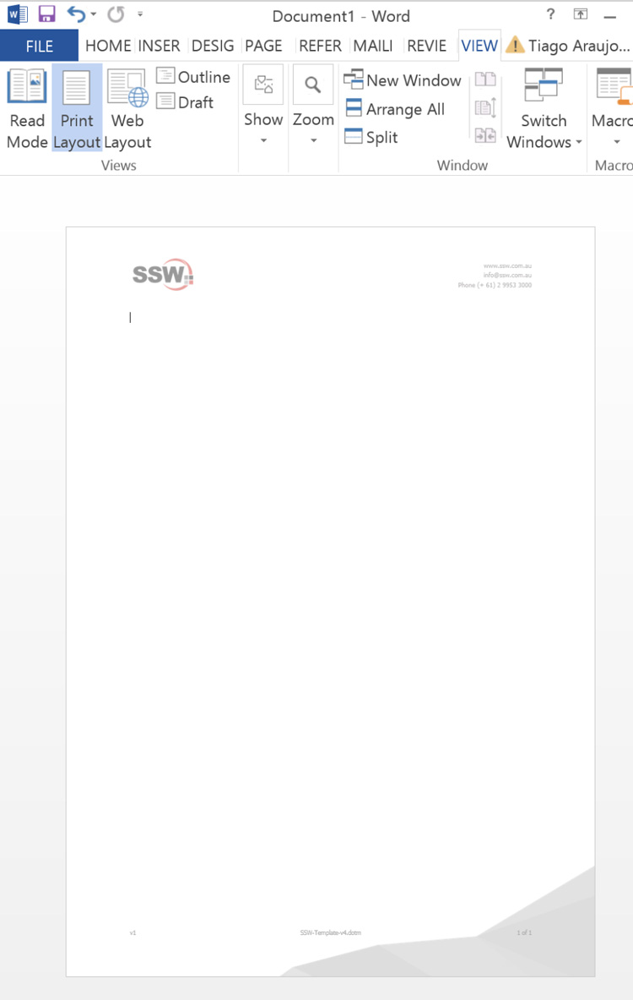

A company-wide template will be implemented, so users have automatic footers to save time and give better branding.

[[badExample]]
| 
[[goodExample]]
| 
 
How to have a company-wide Word template:

- Modify your Normal.dotm file to have the headings and format that you want for Word document
- Create standard employee email footer files e.g. JamesZhou.htm or JamesZho u.txt
- Put the files on a network location - this is the place that will have the master copies 
e.g. \\ssw\ant\standardsinternal\template\
- Have a logon script which is setup through Group policy that will copy the file to the users' computer when they logon.

ECHO Copy Office Templates To Workstation >> %LogonLogFile%
call %ScriptFolder%\SSWLogonScript\BatchScript\SafeCopyNewerFile.bat "\\fileserver\DataSSW\DataSSWEmployees\Templates\Normal.dot" "%APPDATA%\Microsoft\Templates\Normal.dot" %LogonLogFile%
call %ScriptFolder%\SSWLogonScript\BatchScript\SafeCopyNewerFile.bat "\\fileserver\DataSSW\DataSSWEmployees\Templates\Normal.dotm" "%APPDATA%\Microsoft\Templates\Normal.dotm" %LogonLogFile%
call %ScriptFolder%\SSWLogonScript\BatchScript\SafeCopyNewerFile.bat "\\fileserver\DataSSW\DataSSWEmployees\Templates\ProposalNormalTemplate.dotx" "%APPDATA%\Microsoft\Templates\ProposalNormalTemplate.dotx" %LogonLogFile%
call %ScriptFolder%\SSWLogonScript\BatchScript\SafeCopyNewerFile.bat "\\fileserver\DataSSW\DataSSWEmployees\Templates\NormalEmail.dot" "%APPDATA%\Microsoft\Templates\NormalEmail.dot" %LogonLogFile%
call %ScriptFolder%\SSWLogonScript\BatchScript\SafeCopyNewerFile.bat "\\fileserver\DataSSW\DataSSWEmployees\Templates\Microsoft\_Normal.dotx" "%APPDATA%\Microsoft\Templates\Microsoft\_Normal.dotx" %LogonLogFile%
call %ScriptFolder%\SSWLogonScript\BatchScript\SafeCopyNewerFile.bat "\\fileserver\DataSSW\DataSSWEmployees\Templates\Blank.potx" "%APPDATA%\Microsoft\Templates\Blank.potx" %LogonLogFile%
xcopy /Y "\\fileserver\DataSSW\DataSSWEmployees\Templates\NormalEmail.dotm" "%APPDATA%\Microsoft\Templates\" >> %LogonLogFile%
xcopy /Y "\\fileserver\DataSSW\DataSSWEmployees\Templates\NormalEmail.dotx" "%APPDATA%\Microsoft\QuickStyles\" >> %LogonLogFile%
ECHO Templates Copied
Figure: This is a snippet of our login script
 

**Note:** We don't want people using .RTF emails so we include this message in SSW.rtf. Be aware that we don't want to use RTF because of [Remove RTF as an option or explain when it is a good choice](https://www.ssw.com.au/ssw/Standards/BetterSoftwareSuggestions/Outlook.aspx#RemoveRTF).

For more information on why we need to modify the Normal.dotm, you can access the website [http://office.microsoft.com/en-us/word/HA100307561033.aspx](https://www.ssw.com.au/ssw/Redirect/Microsoft/MSOfficeNormalTemplate.htm).

**Note: **If you use a Mac computer, a login script will not work. In order to use a Word template, you must install the template to Word locally, create a new document locally in Word, and then upload that document to Teams.

**Tip:** You can automatically have your SSW Word doc template on sign-in via a script. See https://github.com/SSWConsulting/LoginScript.

### Related Rule 

- [Do you know what makes a great email signature?](/_layouts/15/FIXUPREDIRECT.ASPX?WebId=3dfc0e07-e23a-4cbb-aac2-e778b71166a2&TermSetId=07da3ddf-0924-4cd2-a6d4-a4809ae20160&TermId=73dea04c-b017-4c65-816e-aef8c84497be)
