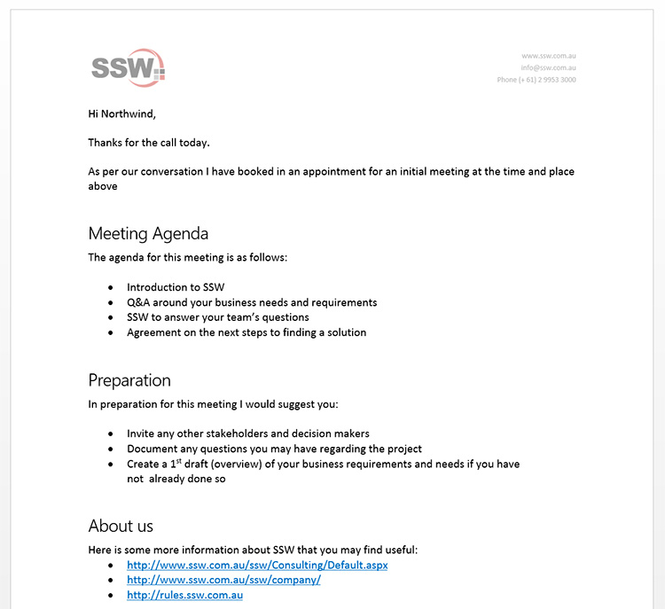

 
###  Schedule a Specification Review

For almost all projects, there is a need for additional requirements gathering. Some clients don't have any kind of specification, while the specifications you are given can sometimes be lacking in detail or incomplete. Accordingly, before you can provide an estimated price for completing the project, there is another step that requires the engagement of your resources - the **Specification Review**.
 
It is the responsibility of the Account Manager during the initial meeting to present the benefits of a Specification Review for the client. Following the initial meeting, the Account Manager will send a​     [brief proposal](/_layouts/15/FIXUPREDIRECT.ASPX?WebId=3dfc0e07-e23a-4cbb-aac2-e778b71166a2&TermSetId=07da3ddf-0924-4cd2-a6d4-a4809ae20160&TermId=8dc33f53-e08f-44d7-9304-ca7b3fe89296) in the form of a     [Post initial meeting](http://www.ssw.com.au/ssw/Standards/templates/BriefProposalPostInitialMeeting.docx) email through to the prospective client for a Specification Review.

**Note: **Make sure everyone who was in the meeting from your company checks the email before it's sent.

It may be necessary to conduct a second initial meeting with a technical specialist attending as well.

You may also find that some clients are unable to progress to a Spec Review until they have a vague ballpark. In these cases, the salesperson is to make the decision whether an extra 4 hours will be spent investigating the solution before the ballpark is given. This should then be sent as part of that "Post initial meeting" email mentioned above, with Spec review info swapped out for ballpark estimate info as required.

A salesperson has 16 hours per month of developer time they can invest in this pre-sales investigation, so this time has to be used wisely.
Figure: Pre-sale meeting - use time wisely

​Never offer a fixed price at the conclusion of an Initial Meeting, and this engagement model must be chosen before the Specification Review is done.

More on the     [Specification Review rules](/_layouts/15/FIXUPREDIRECT.ASPX?WebId=3dfc0e07-e23a-4cbb-aac2-e778b71166a2&TermSetId=07da3ddf-0924-4cd2-a6d4-a4809ae20160&TermId=35fd7784-942a-43ec-8a4b-6edf2fc601ba).
 Figure: Send a [brief proposal](http://www.ssw.com.au/ssw/Standards/templates/BriefProposal.docx)
### Ad-Hoc work/Consulting

In case the work is thought to be less than 3 developer days and the scope is well understood, it may be worthwhile for the developers to commence work straight away without a Specification Review. Normal standards for work should be followed, such as     [daily scrums](/_layouts/15/FIXUPREDIRECT.ASPX?WebId=3dfc0e07-e23a-4cbb-aac2-e778b71166a2&TermSetId=07da3ddf-0924-4cd2-a6d4-a4809ae20160&TermId=731a3f5d-a266-4944-876c-a45afa82832f). This type of work is called 'ad-hoc' work.

You may also immediately commence ad-hoc work if the client is a technical client and you are providing resources for an existing project under the sole direction of the client.

### Related Rule​

- Do you incentivize a quick Spec Review sale?​​​

