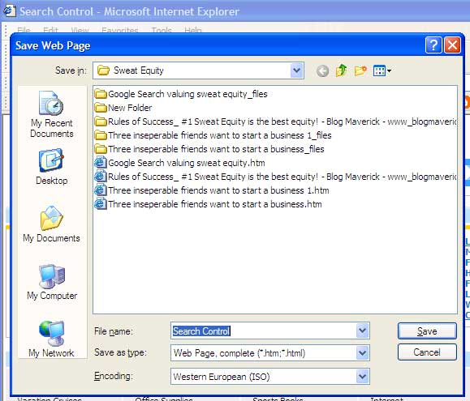

 
Don't use "OK" if the button does one clear action. The button name must reflect the action that is going to happen by clicking the button. Examples of button names that are better than "OK" are:

- Save
- Move
- Rename
- Open
- Select
- Insert
- Print
- Process
- Login

  ​Figure: Save button in action
However, there is an exception when there are multiple settings being changed. Typical examples are Properties and the Tools - Options dialog. There are often many tabs with many options. It would make no sense to have "Save Settings" or "Save". This is where the "OK" "Apply" "Cancel" convention really applies.

