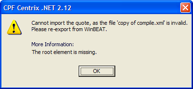

#### Description

The description should explain *what the error was*, followed by the *why it occurred*. Information that is useful for debugging should be included with errors where possible in a "Details" section. You should also avoid making the text unnecessarily wide. e.g.
 
[[badExample]]
| 
- This is confusing, because it uses different terminology to the title ("estimate" instead of "quote")
- There is no punctuation
- The word "Error" is meaningless
- Line breaks are not present, so the message box is too wide and the text may wrap in the wrong spot

[[goodExample]]
| 
- Terminology is consistent
- Punctuation is present
- "Details" indicates that this information is useful for debugging
- The text is split across three lines, and the technical information after Details is separated from the description of the error
