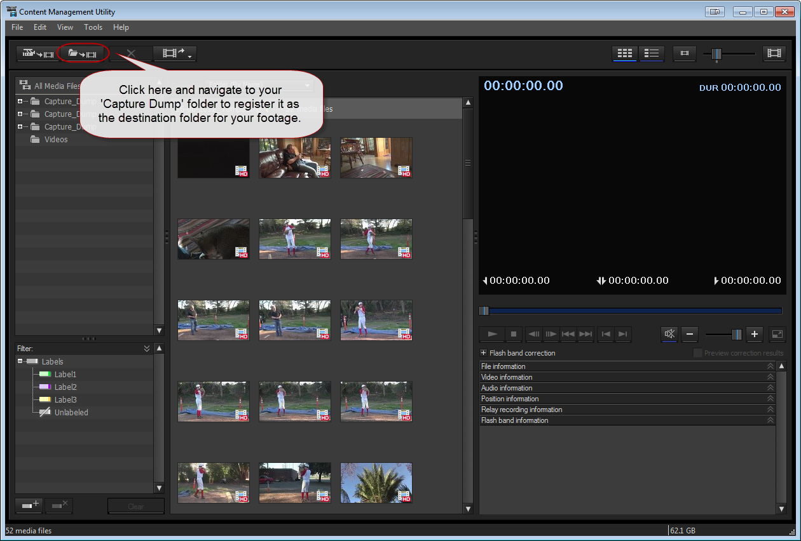
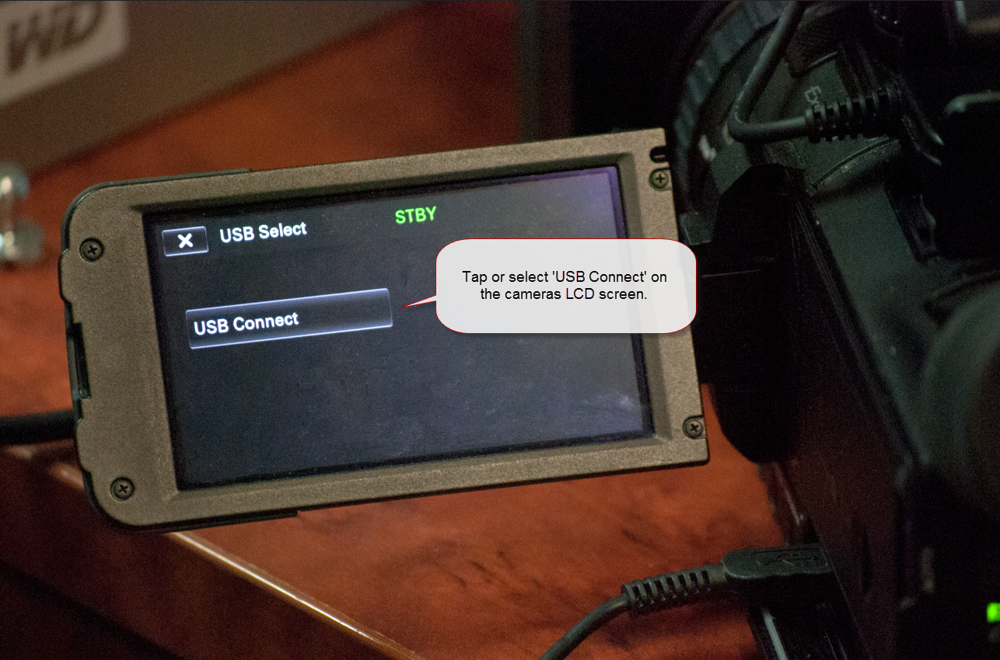
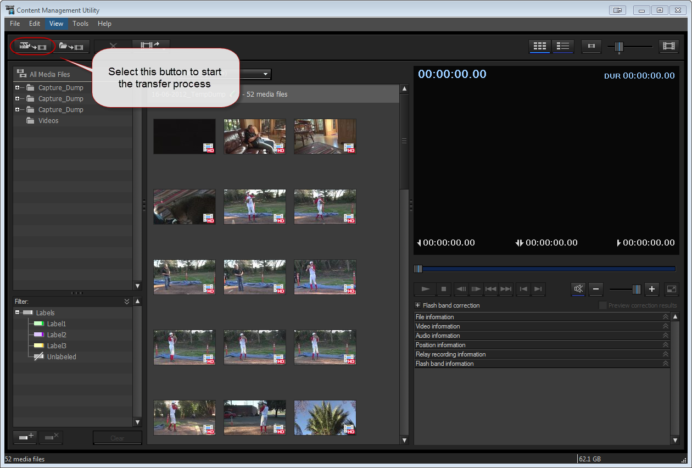
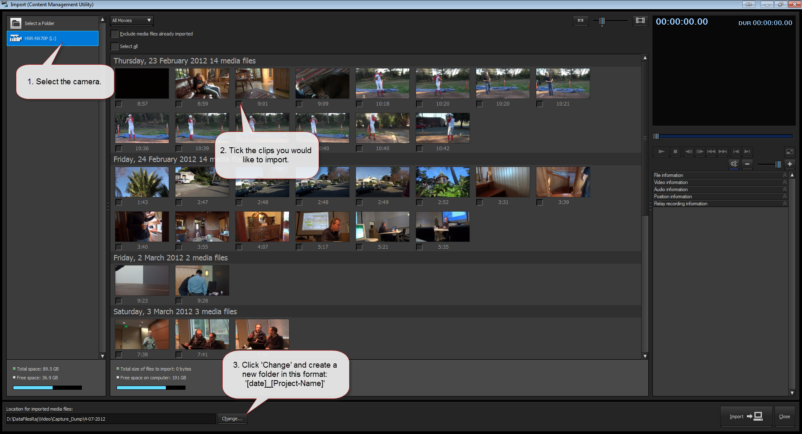

AVCHD is a highly compressed ‘HD’ format used by many modern consumer and professional cameras.

Because of the limitation FAT32, AVCHD cameras record to their memory in 4GB chunks. These split files need to be combined using software into one file that is usable in editing programs, such as Adobe Premiere Pro (Premiere Pro will read the split files directly from the camera, however,​ if you try and manually combine all the files in the timeline you will have problems with the audio at the beginning and ends of each split clip).

We will go through the process of using Sony Content Management Utility software to correctly and safely convert and transfer the raw footage from your camera to your computer.
 
### Transferring and converting the footage automatically

1. Install the ‘Content Management Utility’ software. (http://www.sony-asia.com/support/download/401976)
2. The utility works by creating a database of all files that are transferred to your computer. You have to select folders that the software will ‘register’ as its destination folder. Before launching the program, you need to create a destination folder.
    - Create a folder in your data drive called ‘Capture\_Dump’. This should be the default place you transfer all raw footage to (you will move the footage from here to your project folder as described in a later step).
    - Open ‘Content Management Utility’
    - A dialogue will prompt you to navigate to your destination folder. Navigate to the ‘Capture\_Dump’ folder you created in step ‘1’ and select it. If you do not get this prompt, select the ‘Register Folders to View’ button on the top left of the window: 

3. Connect the camera to your computer, and using the LCD, press 'USB Connect  

4. Open the ‘Content Management Utility’. Click on the camera icon on the top left of the window to open a new transfer window:  

5. In the new import window:
    - Select the camera in the left column (or select the folder icon if you’re transferring from a memory card). Video thumbnails will appear in the central part of the screen.
    - Select the clips you would like to transfer to your computer.
    - At the bottom of the window, click the ‘Change’ button and rename the folder to: ‘[date]\_[Project-Name]’
 
 6. Finally, select the ‘Import’ button on the bottom right of the screen:  

7. After the import is complete, navigate to the folder using Explorer. Check each of your videos to make sure they play. You want to check for any corrupted videos or videos containing artefacts. Skip through the video so you can thoroughly check its content for issues. Tip: Use VLC media player as your default player for .mts and .mt2s files. (http://www.videolan.org/vlc/index.html)
8. After you have checked all the videos, delete the clips from the camera directly (you cannot delete them via the software).
**Tip:** Only do this if you are sure the transferred videos contain no issues.
9. Move the footage from the Capture\_Dump folder to their relevant project folders located on your hard drive.

**Transferring and combining the footage manually**

If you are unable to use the Content Management Utility for some reason - maybe because you are on site and don’t have access to it, and you need to transfer files off the camera to make room - there is a manual process to combining the files later.

1. To find your recordings, navigate to G\*:\AVCHD\BDMV\STREAM
2. Note: Replace ‘\*’ with the appropriate drive letter of your camera
Follow the steps outlined here: http://avchdvideos.blogspot.com.au/p/joining-my-avchd-videos.html
