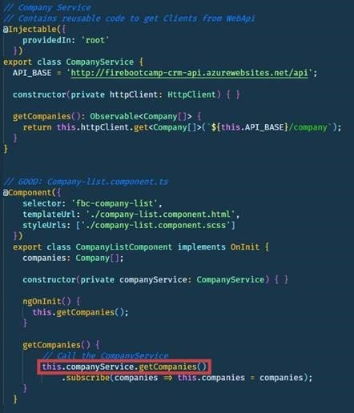

A Service is a singleton object with a lifetime scope of the application.  It is instantiated only once during the lifetime of an application.  When combined with Angular’s Dependency Injection, a service can be injected into any component in an application via Constructor Injection. This makes a Service perfect for sharing reusable functionality throughout an application.
 
A common example of when you’d use a Service is when you want to retrieve data from a WebApi using the HttpClient. There may be several places in your application where you need to retrieve the same list of data. By placing this functionality in a Service it gets rid of the duplicated code in the components that make the WebApi call.
](reusable-service-bad.jpg)
