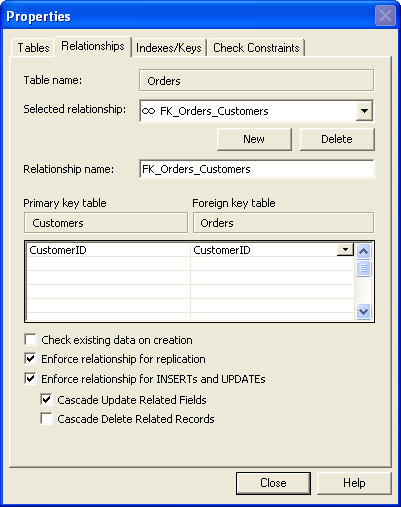

 
​Cascading referential integrity constraints allow you to define the actions SQL Server takes when a user attempts to delete or update a key to which existing foreign keys point. The REFERENCES clauses of the CREATE TABLE and ALTER TABLE statements support ON DELETE and ON UPDATE clauses:

- [ ON DELETE { CASCADE | NO ACTION } ]
- [ ON UPDATE { CASCADE | NO ACTION } ]

NO ACTION is the default if ON DELETE or ON UPDATE is not specified.​​
 
​Relationships should always have referential integrity turned on. If you turned it on after data has been added, you may have data in your database that violates your referential integrity rules.
Figure: Recommended referential integrity constraints
