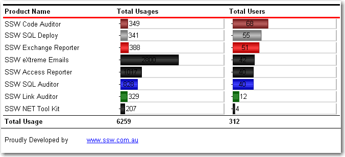
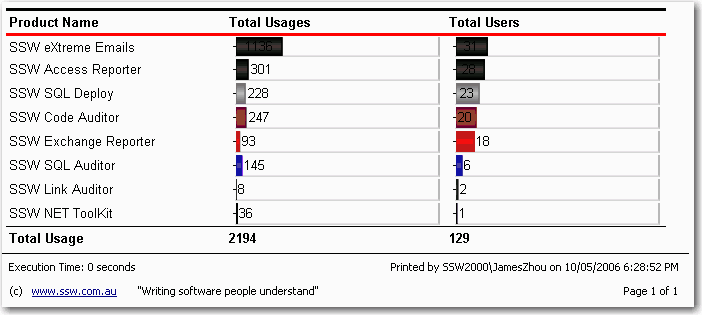

When designing custom applications you want to include branding on reports.                      You should always include a useful and informative footer at the bottom of your reports.
 
Include:

1. Date and Time Printed and User who printed it - see warning below (e.g. Printed by SSW2000\JatinValabjee on 3/1/2006 3:16:30 PM)
2. Execution Time (e.g. Execution time: 1 minute, 10 seconds)
3. Page x of y (e.g. Page 3 of 10)
4. Link to company website + slogan  (e.g. www.ssw.com.au - Writing software people understand)

 

Use these handy report expressions to show the above information.

**NOTE:**  Do not use System.DateTime.Now for your Execution Time because if you do it will return the result at time of printing the document/PDF.  Instead store the value in a variable (for example GroupExecutionTime) and then call that.

| Footer Item | Expression | Sample Output |
| --- | --- | --- |
| Date and Time Printed / User ID | ="Printed by " + User!UserID + " on " +                              Globals!ExecutionTime.ToString() | Printed by SSW2000\JatinValabjee on 3/1/2006 3:16:30 PM |
| Execution Time |                             ="Execution Time: " +                              IIf((Variables!GroupExecutionTime.Value.Subtract(Globals!ExecutionTime).TotalSeconds < 1, "0                              seconds",                                                           (                              IIf((Variables!GroupExecutionTime.Value.Subtract(Globals!ExecutionTime).Hours > 0, (Variables!GroupExecutionTime.Value.Subtract(Globals!ExecutionTime).Hours & " hour(s), ", "") +                              IIf((Variables!GroupExecutionTime.Value.Subtract(Globals!ExecutionTime).Minutes > 0, (Variables!GroupExecutionTime.Value.Subtract(Globals!ExecutionTime).Minutes & " minute(s), ",                              "") +                              IIf((Variables!GroupExecutionTime.Value.Subtract(Globals!ExecutionTime).Seconds > 0, (Variables!GroupExecutionTime.Value.Subtract(Globals!ExecutionTime).Seconds & " second(s)", ""))                              )                          | Execution time: 1 minute, 10 seconds |
| Page x of y                          |                             ="Page " + Globals!PageNumber.ToString() + " of " +                              Globals!TotalPages.ToString() |                             Page 3 of 10 |

 

**Warning:**  Adding the User who printed it stops all data-driven subscriptions     
When you try to add the User your data-driven subscriptions will fail with the following error:
'The '/GroupHealth' report has user profile dependencies and cannot be run unattended. (rsHasUserProfileDependencies)'.     
A quick workaround is to add a user function to fallback the error to a nice message, like: "SYSTEM",

 Public Function UserName()

> Try
> 
> 
> > Return Report.User!UserID
> 
> 
> Catch
> 
> 
> 
> > Return "System"
> 
> 
> End Try

End Function     

Use above function to replace your reference to Report.User!UserID will allow the subscription to work correctly.
