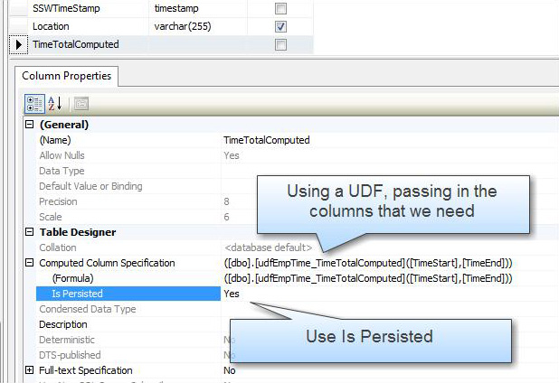

When you have a denormalized field, use a computed column.  In SQL Server ​they can be persisted.

Use the suffix "Computed" to clearly distinguish that this field is a computed field.

[[badExample]]
| 

(and it has the correct name)

 
Computed columns have some limitations - they cannot access fields in other tables, or other computed fields in the current table.

You can use user-defined functions (UDF) from code in a reusable function, this allows one computed column to use a function to call another function.  Here is an example:​

ALTER FUNCTION [dbo].[udfEmpTime\_TimeTotalComputed]

(
@TimeStart as DateTime,
@TimeEnd as DateTime     
)
RETURNS DECIMAL(8,6)
AS
BEGIN
-- This function returns the time difference in hours - decimal(8,6)
​RETURN (round(isnull(CONVERT([decimal](8,6),@TimeEnd - @TimeStart,(0))\*(24),(0)),(2)))

 END​
Figure: This is the user defined function

