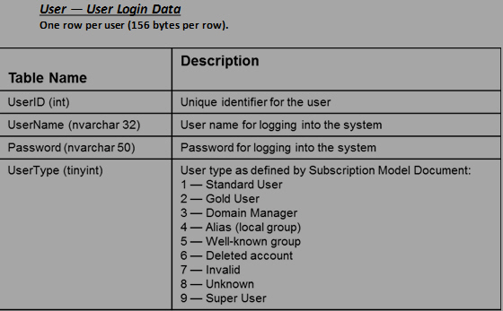

Different clients will have different levels of documentation on what they want to be built. You need to be ready to do a spec review for any one of the following 5 possible cases:
 
#### Types of specifications

### 1. I have an idea...

Run from this
or
verify they have a really hefty bank account!

### 2. High-Level Requirements Document

[greyBox]
 This will read like a wish list with no details and many unanswered questions 
[/greyBox]
Figure: High-Level Requirements are very vague and open to many interpretations
### 3. Detailed Requirements Document

The details have been fleshed out and allow developers to write Functional and Technical Specifications
- We need a login page for www.northwind.com
- Must match existing site look and feel
- Username is already in the Users table in the ABC database (SQL Server 2008)
- Password should be at least 8 characters
- .NET 4 is already used for the existing site so that is what this should use of course
- Should look like this:


### 4. Functional Specification
This will include detailed mock-ups for the UI, use cases/user stories and might be at a level to allow for fixed price quoting on the project
- We need a login page for [www.northwind.com](http://www.northwind.com/)
- Must match existing site look and feel
- Users table must be defined and added to the ABC database (SQL Server 2008)
- **User Name consists of user first initial and first 7 characters of the last name** 
-  **For example Joe Jones -> jjones**
- Password should be at least 8 characters
- Site uses .NET 4 and this interface must be added to existing project
- This is the layout for the login interface
- **A red asterisk (\*) should be displayed if a value is left blank and Submit is pressed** 


### 5. Technical Specification

This is the blueprint for the application. There should be no unanswered questions and should allow for a fixed price quote.

- We need a login page for www.northwind.com
- Must match existing site look and feel
- Users table must be defined and added to the ABC database (SQL Server 2008)
- User Name consists of user first initial and first 7 characters of the last name
- For example Joe Jones -> jjones
- Password should be at least 8 characters
- Site uses .NET 4 and this interface must be added to existing project
- Define the data model explicitly

- Must work with IE7, IE8, IE9, and FF3
- Must display correctly at 1024x768 resolution
- Must support ANSI characters for Username and Password
- Will not support mobile browsers
- Will not be tested with localization (assumes en-us local on US versions of software)
- SQL Membership provider will be leveraged

   Figure: Technical Specifications will become the blueprint of the application. There shouldn’t be any unknowns
