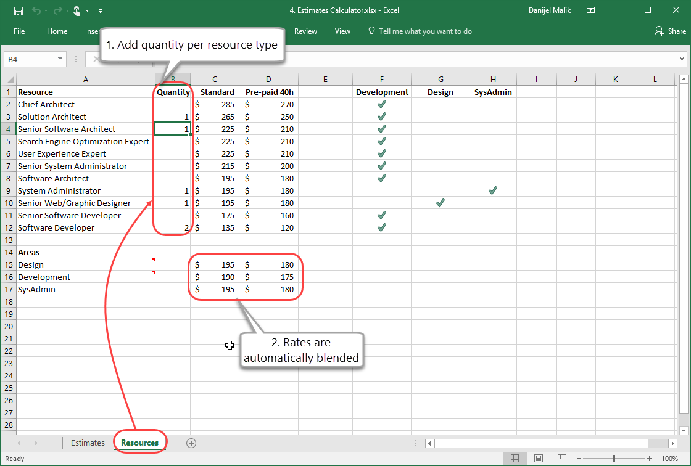
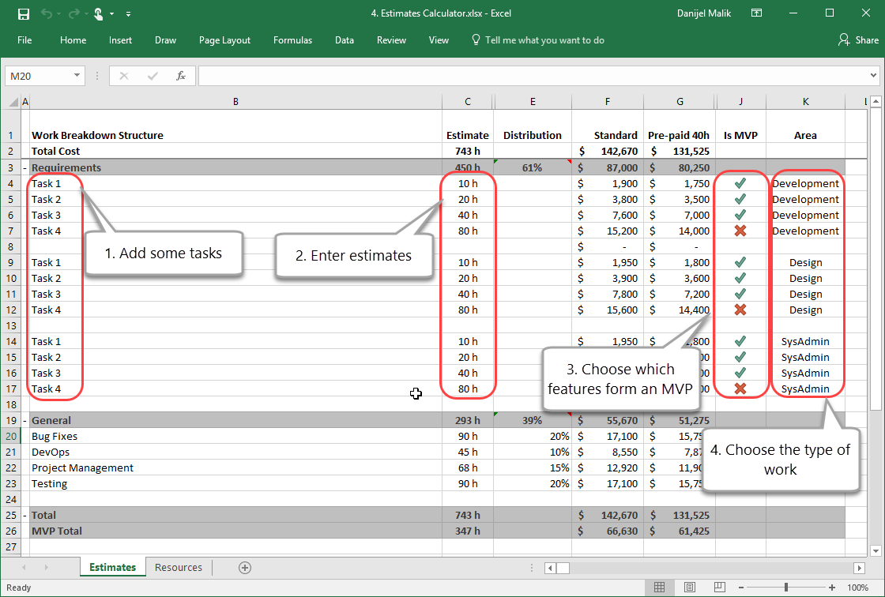

### ​How to create an Estimate For a Spec Review (Summary)

This process can take up to a few days, so if you're just after a ballpark, use epics instead of PBIs (Product Backlog Items).

Here are the 8 steps:

1. ​​​List all of the PBIs into a Backlog in TFS (or visualstudio.com), sizing them with story points.
2. Open Excel and connect to the above Backlog
3. In Excel, add a column called "Hours"​
Note: Once we move to estimating in time, this is no longer Scrum.
4. In Excel, copy this list and paste into another spreadsheet called the [Estimates Calcul​ator](/Documents/4.%20Estimates%20Calculator.xlsx?d=w6f09d6a75d074fbda81e5e5dd3e18c76), in order to add all of the extra items (testing, DevOps, Project management, etc.). **See below for how to use this.**
Note: It would be great if TFS (or visualstudio.com) had functionality to add [standard items to a Sprint](http://www.ssw.com.au/ssw/Standards/BetterSoftwareSuggestions/TeamFoundationServer.aspx#StandardItems)
5. Run a [Test Please](/_layouts/15/FIXUPREDIRECT.ASPX?WebId=3dfc0e07-e23a-4cbb-aac2-e778b71166a2&TermSetId=07da3ddf-0924-4cd2-a6d4-a4809ae20160&TermId=d66a9404-2ca9-4d19-ad6c-df1618b4fc28) on the numbers
6. Add this spreadsheet to your specification review document
7. Present to the client
8. Much later, when the estimate is approved by the client, start work following these rules: [Rules to Better Project Management with TFS](http://www.ssw.com.au/ssw/Standards/Rules/RulesToBetterProjectManagementWithTFS.aspx).

### More Info - How to use the Esti​mates Calculator

Open the [Estimates Calculator](/Documents/4.%20Estimates%20Calculator.xlsx?d=w6f09d6a75d074fbda81e5e5dd3e18c76) and do the following:

Figure​: Enter your PBIs and estimates

### Why Microsoft Project isn't recommended

MS Project is a good app that and we do like how you can now add 2 people to a task and the calculations and dependencies are all worked out for you, however:

- In MS Project, tasks are auto scheduled based on dependency and resource allocation (who is assigned to it). This generates an estimated completion date which is never accurate, due to annual leave, public holidays and general shuffling of people in the team
- It gets the summing wrong (the totals don't seem to update and no way to trigger it)
- It's hard to synchronize with timesheets (as it doesn't connect to 3rd party timesheet systems out of the box – however, it does have its own time sheeting system... that is missing billing information!)​
