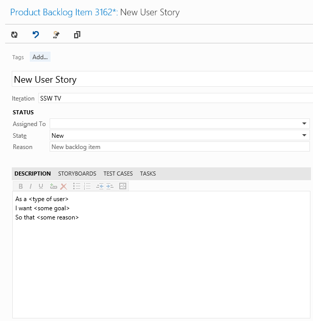

Product Backlog Items (PBIs) can be described in the form of a "User Stories" when appropriate. It ensures the developers will know the context for a PBI.

As a 
I want 
so that 
Figure: User Story - template for description
 

I want to be able to search for customers.
Figure: Bad Example - the user story is too vague and broad in scope
As a Marketing Manager...
    I want to be able to search for customers by country and last name.
    So that I can find their numbers and call customers close to me.
Figure: Good Example - Clear user story following the INVEST principle

**Note:** In the TFS Scrum template (since we now have a title, description, and acceptance criteria), we no longer generally need to use User Story formatting.
