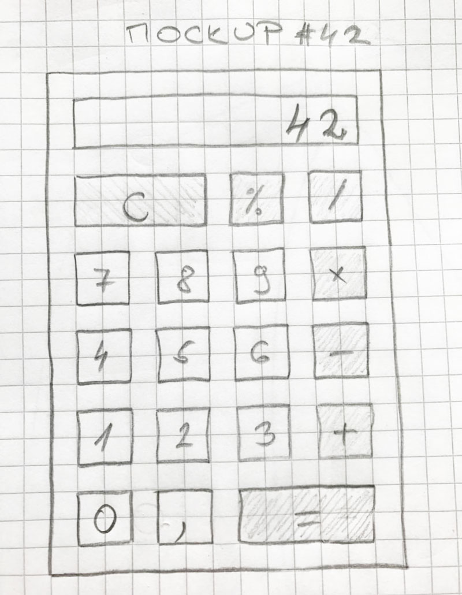
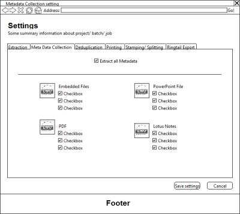
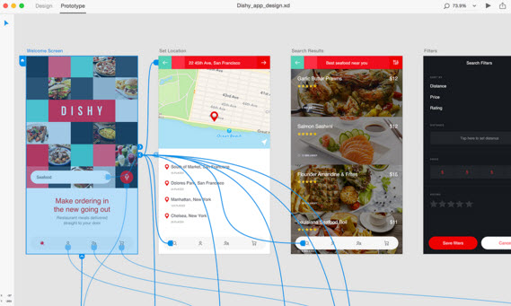
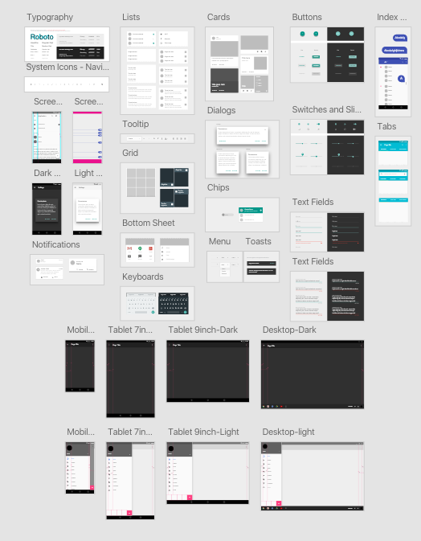
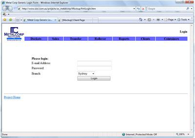
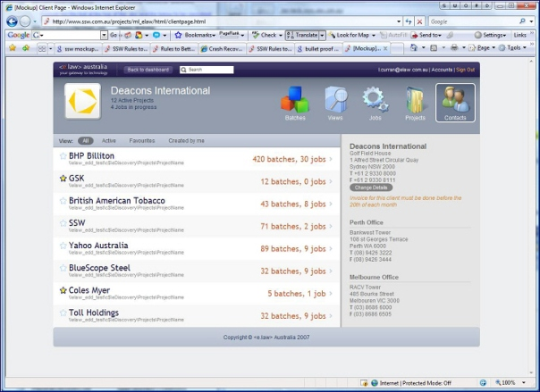
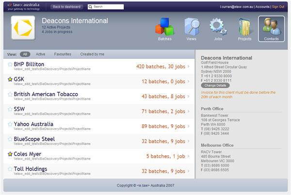
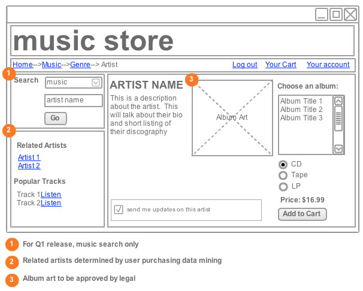
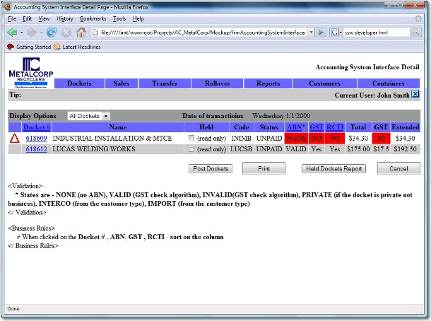
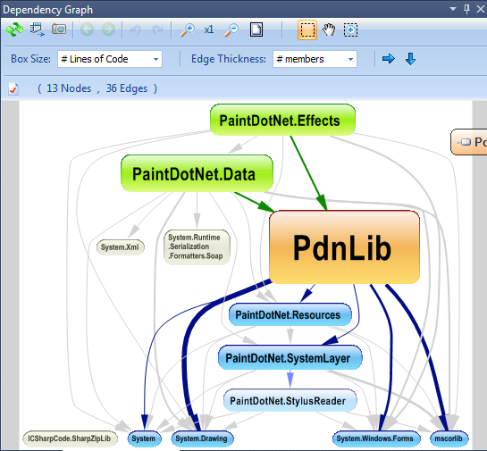

Complex documentation can waste time. Many user requirements can be best encapsulated in screen mock-ups. Spend more time on mockups compared with time on documentation.

 
Storyboarding is a technique taken from movie production.
 

Source: [Woodsman Film Company](http://www.thewoodsmanfilm.com/importance-storyboarding-filmmaking/)

There are five primary types of mockups:

1. **Hand drawn Mockups**
2. **Wireframe Mockups**
3. **Developer HTML Mockups**
4. **Designer HTML + CSS Mockup**
5. **Designer Photoshop Mockups **(recommended)

Often it's best to start with some hand-drawn ones to get started. Then if you have access to designers, complete a couple of full 'Designer Photoshop Mockups' for "look and feel" approval, then complete the balance as wireframes.

### Hand drawn Mockup

'Hand drawn Mockups' are recommended to be done with the customer. Since it doesn't deal with any styling/color issues, 'Photoshop Mockups' will be needed after.
 

### Wireframe Mockup

A layout of how the controls will look is usually all that is needed initially, without worrying about images. [An example of Wireframe Mockup](http://www.ssw.com.au/projects/ml_elaw/scenarios/index.html)

**Tip:** The tools to develop a wireframe depend on your skillset and the front end technology chosen. For example use:

- Microsoft PowerPoint (ubiquitous)
- [Balsamiq](http://www.balsamiq.com/) 

- [Adobe XD](http://www.adobe.com/au/products/experience-design.html) - preloaded with the most popular UI design blocks **(recommended for web & mobile app design) **

 

 

### Others 

- [Sketch](https://www.sketchapp.com/) (Mac Only and for UX designers)
- [Moqups](https://moqups.com/) (HTML5 based App)
- Photoshop (primarily for designers who already have the skills)
- [UXPin](http://uxpin.com/) (more sophisticated, helps you create responsive designs)

### Developer HTML Mockup

These are mockups done in the front end technology that will be used. Meaning it could be done as a Web/Windows Forms/Access UI with limited functionality:

[An example of an ugly Developer HTML Mockup](http://www.ssw.com.au/Projects/AC_Metalcorp/Default.aspx).
 
(if even possible) + this reeks of Bodgy Brothers and doesn't do a very good sales job
### Designer HTML Mockup

These are also mockups in a Web/Windows Forms with full CSS Styling and graphic designer enhancements:

[An example of a pretty Designer HTML Mockup](http://www.ssw.com.au/projects/ml_elaw/html/clientpage.html)
 
(and change is all you do at the beginning of a project)
### Designer Mockup

These are concept mockups produced by designers in Photoshop providing a guidance of the final look with full styling.

**Warning:** Don't go down the track of giving a customer a few concepts (on some projects we gave 2 or 3 completely different concepts by different designers). There becomes too much mixing and matching when they see them. Once the images are approved, then the designers slice them up and turn them into HTML (slicing is the exporting of each image).
 

**More information – Add notes at the bottom**

Wireframes should include numbers (in orange circles) and notes at the bottom, explaining features and/or indicating priority.
 

Mock-ups notes should also include the business rules that apply to the page. If there are a lot of rules then it is acceptable to link off to a Microsoft Word document.
 
[[goodExample]]
| 
### Don't use UML - it is virtually impossible to get clients to understand these.
 

UML is not all bad. UML and other formal documentation methods can be useful for developers.

The overarching problem is it gets out of date, so it gathers dust (aka Technical Debt).
A better way of getting documentation is to flesh out the classes and use the VS Dependency Graph or NDepend.
A demo can be seen in the 2nd video ["A Modern Architecture Review"](http://channel9.msdn.com/Events/TechEd/Australia/2012?sort=sequential&direction=desc&term=&s=adam%2Bcogan).
 

## Summary

Mock-ups and wireframes are far easier to understand.

For example, to communicate that “a customer has many phone numbers”, a storyboard/wireframe of how that relationship will appear in the user interface is highly more likely to be understood by the client.

The clear communication of the message is more important than the medium used to convey that message.

Here are some more hot tips on mock-ups:

- Avoid the thought of a "throw-away" prototype. An example of a throwaway prototype is when you design screens in Access, but the application will be HTML. So design the screens you and the customer are happy with the technology you will be using, and then use them in the app.
- It is best to have a designer and developer and customer working together.
- Get the mock-ups [physically initialed](/Pages/AskClientsToInitialYourWork.aspx), especially if you are performing a fixed-price contract. Yes, paperless is great - but not in this case.
- If you can't get mock-ups initialed, then page by page approval over email is the 2nd best option.
- A tip I picked up from Tom Howe was to always add a client's branding into the mockup - it makes a big impression
- Mock-ups should follow [standard interface rules](http://www.ssw.com.au/ssw/Standards/Rules/RulesToBetterInterfaces.aspx)
- Write the related business rules at the bottom of each screen - and turn into unit tests.

### Related Rules

- [Spec - Do you effectively present the outcomes at the "Specification Review Presentation"?](/_layouts/15/FIXUPREDIRECT.ASPX?WebId=3dfc0e07-e23a-4cbb-aac2-e778b71166a2&TermSetId=07da3ddf-0924-4cd2-a6d4-a4809ae20160&TermId=2a0ffac9-689f-481a-a76b-56bd680310a9)
- [Do you ask clients to initial your work?](/_layouts/15/FIXUPREDIRECT.ASPX?WebId=3dfc0e07-e23a-4cbb-aac2-e778b71166a2&TermSetId=07da3ddf-0924-4cd2-a6d4-a4809ae20160&TermId=69588363-1343-4697-8520-a04465e4ac1b)
